# ECE 445 Lab Notebook

**Name:**  Eric Vo
**Project:** OscilloSketch
**Semester:** Spring 2026

---

# Entry 1
**Date:** 01-27-2026  
**Session Duration:** ~2 hours  
**Location:** Remote

---

We finalized and submitted the Request for Approval, where we proposed to create a handheld device that generates stable, low-noise bipolar ±5V X/Y signals for scilloscope XY mode. This helps users create custom waveforms without messing around with complex bench instruments. The project would entail building a small device that turns user input into clean X and Y voltages. Two rotary encoders would let the user “move” the dot left/right and up/down, and buttons would handle things like reset and mode changes. A microcontroller would read the encoders and update the outputs at a steady, fixed rate using a hardware timer.

Signal Flow:
1. MCU reads user input through rotary encoders and buttons
2. MCU processes data and outputs SPI into dual-channel DAC
3. DAC outputs analog XY and gets filtered, offset, and scaled to range from -5v to +5v
4. Output scaled analog output to BNC, which connects to the oscilloscope

Power Flow:
1. Take USB-C 5v input
2. Feed 5v into the 3.3v LDO to power the MCU and DAC
3. Feed 5v into the inverting charge pump for -5v to power the op-amp

Subsystem:
- User Input
- Microcontroller + Firmware
- Daul-Channel DAC + Analog Output
- Power Regulation

Required for Success:
- Generate two analog outputs centered at 0 V with selectable range up to ±5 V
- Demonstrate stable interactive drawing in oscilloscope XY mode
- Implement timer-driven deterministic DAC update engine
- Include output protection such that a short-to-ground fault does not damage the device or the scope

We have thought of some cool stretch goals, like having z-axis blanking output, which allows us to disconnect the continuous line and vector-rendered demo/game mode, which allows us to display prewrite images onto the oscilloscope. 

However, some of the concerns we have are adding an SD card or USB drive, since that adds another unknown layer to this project. We worry that there won't be an easy way to upload the data for an image or game and then read from the SD card itself. Another thing we have to think more about is which MCU to use, since I am more comfortable with the STM32, but it is very complex and intricate. Josh has mentioned the ESP32, but I have no experience with it and don't know if I can get it to flash, which is a big issue. We also do not know which resolution to get for the DAC, since the more bits, the finer the drawing will be, but at a certian points it is not noticeable.

By the end of our discussion, we submitted the RFA and decided on how the power and signal would flow through the project. For the future, we need to make sure we know exactly what components to use. 

---

# Entry 2
**Date:** 02-03-2026
**Session Duration:** ~2-3 hours  
**Location:** Remote

---

During this meeting, we wanted to discuss the components and what the requirements for the components should be, along with their cost. The main components that we will discuss today are the MCU, DAC, and the inverting charge pump. 

We compared the STM32 MCU against the ESP32 MCU based on timers, SPI speed, USB programming, and how many GPIO pins we would need. Overall, they both had the same functionality and speed for timers. By the end, we chose the ESP32-S3 because it has built-in USB programming, plenty of timers for steady updates, enough speed for UI + drawing features, and a strong software ecosystem.

We also checked whether a 12-bit DAC is good enough for drawing. Since our output range is -5 V to +5 V (10 V total span), a 12-bit DAC gives 4096 steps, which works out to about 10 V / 4096 ≈ 2.4 mV per step. For oscilloscope XY drawings, that step size is smaller than what you can easily see on-screen and is usually smaller than the noise you’ll already have, so going to 16-bit wasn’t worth the extra cost and extra complexity.

Another big point was making sure the drawing looks consistent on the scope. If the DAC update timing jumps around, the brightness can look uneven, and the picture can flicker. So we set a firm rule that the DAC updates must be driven by a hardware timer, meaning the update loop runs on a fixed schedule. The UI code (reading encoders/buttons, mode changes, etc.) should never be allowed to delay the DAC update stream.

Finally, we sanity-checked SPI speed. Even at a conservative 20 kHz update rate, sending two 12-bit values is only 24 bits per update, which is roughly 24 × 20,000 = 480,000 bits/sec (about 0.48 Mbps) before overhead. That’s far below what the ESP32-S3 SPI can handle, so SPI speed won’t be our bottleneck as long as the DAC can also handle that fast of SPI speed. To reduce noise, power consumption, and timing issues, we also decided to turn off WiFi/Bluetooth during signal generation. 

By the end of the session, we decided to use the ESP32-S3FN8 as our microcontroller and an external dual-channel 12-bit SPI DAC for generating the X/Y signals. [ESP32-S3 datasheet](https://www.espressif.com/sites/default/files/documentation/esp32-s3_datasheet_en.pdf)

---

# Entry 3
**Date:** 02-10-2026
**Session Duration:** ~3 hours  
**Location:** ECEB

---

For this meeting, we needed to create the formal project proposal and produce a refined block diagram, along with clear high-level goals and subsystem requirements. We also wanted an early power estimate so we could pick realistic regulators and make sure the USB-C supply would be enough.

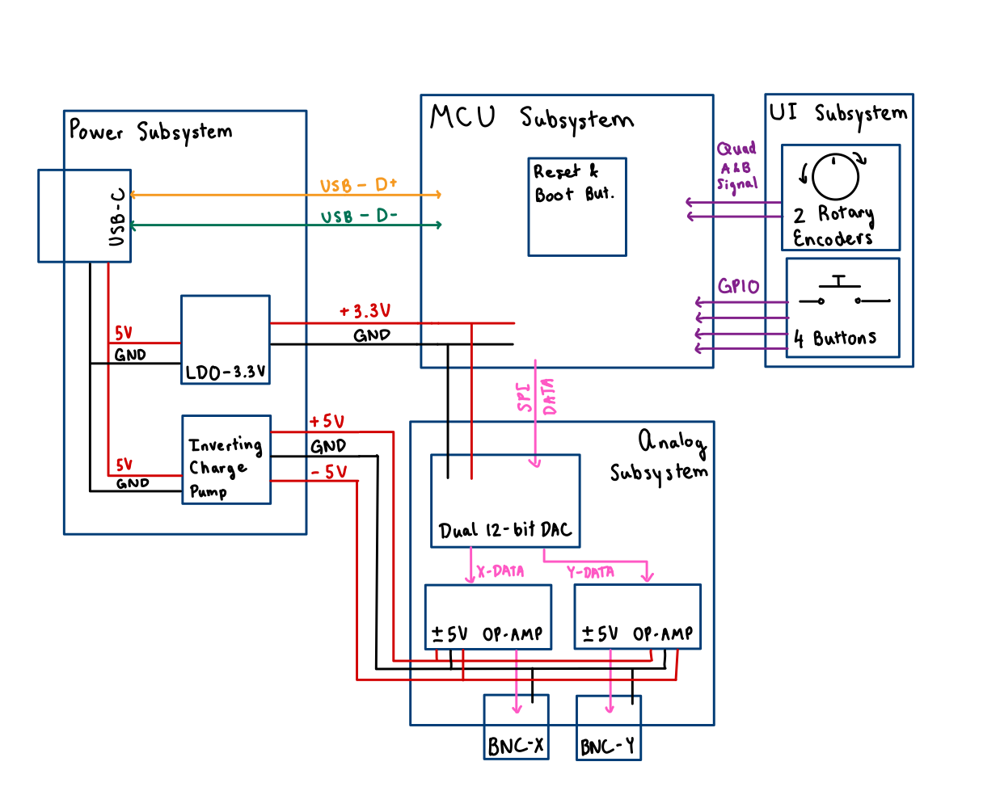

We made a cleaner system block diagram (Figure 1) that shows the full design from end to end: USB-C power → 3.3 V LDO + −5 V charge pump, an ESP32-S3, two encoders + four buttons, a dual 12-bit DAC, op-amp conditioning, and BNC X/Y outputs. We also clearly labeled the main connections: SPI from the MCU to the DAC, encoder A/B into the MCU, buttons into GPIO, and analog outputs to the BNC connectors.

We then set three top-level project goals that the whole design must meet: (1) functional ±5 V X/Y output, (2) real-time user control (smooth drawing without lag), and (3) single-cable USB-C operation. After that, we broke the system into subsystems (power, MCU/firmware, analog output, UI) and wrote down what each one must do so we can test it later.

We also did a quick power budget to make sure our parts make sense. With RF disabled, we estimated the ESP32-S3 could draw about 200–240 mA, the DAC about 5–10 mA, and the op-amps about 10–20 mA, giving roughly 260–300 mA peak total. With extra margin, we concluded the 3.3 V regulator should be rated at least 500 mA, and we noted the −5 V rail needs enough charge pump capacity to handle the op-amp load.

By the end, we confirmed the overall architecture (separate digital 3.3 V and analog ±5 V domains, level shifting to center at 0 V, short-to-ground tolerant output stage, and careful mixed-signal PCB layout). We approved the updated block diagram and used it as the basis for the proposal. Next, we plan to start the schematic, choose exact DAC and op-amp parts, refine the negative rail approach, and decide the maximum output frequency we want to support.

---

# Entry 4
**Date:** 02-12-2026
**Session Duration:** ~3 hours  
**Location:** ACES Funk Library

---

For this meeting, we planned on picking all of the components and starting the schematic. 

Here is the list of components that ended up getting chosen:
- Inverting Charge Pump: LM27762DSST [link](https://www.digikey.com/en/products/detail/texas-instruments/LM27762DSST/6234957)
- Microcontroller: ESP32-S3FN8 [link](https://www.digikey.com/en/products/detail/espressif-systems/ESP32-S3FN8/15822446)
- Dual 12-bit DAC: MCP4922 [link](https://www.digikey.com/en/products/detail/microchip-technology/MCP4922-E-SL/716258)
- Dual Op-Amp: OPA2192 [link](https://www.digikey.com/en/products/detail/texas-instruments/OPA2192QDGKRQ1/8322744)
- LDO: AZ1117C [link](https://www.digikey.com/en/products/detail/diodes-incorporated/AZ1117CH-3-3TRG1/4470985)
- TVS Diode Protection: TPD2EUSB30ADRTR [link](https://www.digikey.com/en/products/detail/texas-instruments/TPD2EUSB30ADRTR/2520830)
- USB_Connector: USB4215 [link](https://www.digikey.com/en/products/detail/gct/USB4215-03-A/24395489)
- Buffer Op-Amp: TLV9061IDBVR [link](https://www.digikey.com/en/products/detail/texas-instruments/TLV9061IDBVR/9771994?s=N4IgTCBcDaICoBkBqBOADANgIwEkAiAQkiALoC%2BQA)
- BNC Connector: CONBNC002 [link](https://www.digikey.com/en/products/detail/texas-instruments/TLV9061IDBVR/9771994?s=N4IgTCBcDaICoBkBqBOADANgIwEkAiAQkiALoC%2BQA)
- Rotary Encoder: PEC11R-4220F-S0024 [link](https://www.digikey.com/en/products/detail/bourns-inc/PEC11R-4220F-S0024/4499660?gclsrc=aw.ds&gad_source=1&gad_campaignid=20504615262&gbraid=0AAAAADrbLlh-Xpv7BeVk2DolS7mw4Ei7L&gclid=CjwKCAiAncvMBhBEEiwA9GU_fng9zQn0728rQmIBpjGYQPMPQt_0od9oJhHU58XtyYJZ6IpkS2r6sRoCvZ4QAvD_BwE)

For the KICAD schematic, we made sure to put lots of test points for debugging in the future. At the moment, we are unsure how to power the ESP32-S3 since there are many different examples online. Shown below is the current unfinished schematic (Figure 2). 

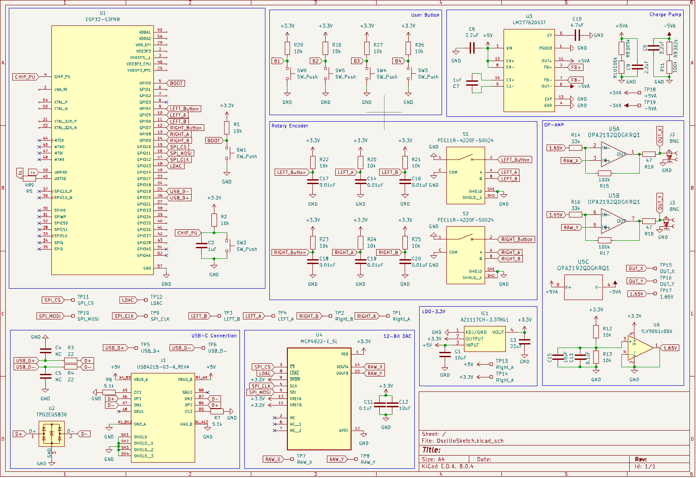

---

# Entry 5
**Date:** 02-24-2026
**Session Duration:** ~7 hours  
**Location:** ECEB / Remote

---

During this session, I focused on starting and finishing the PCB layout for the OscilloSketch since in a few days the first round of PCBs will be order and we wanted to have an early PCB for testing. This way, if I made any mistakes I could fix it on the next iteration. 

I started by placing and organizing the main components, then routed the important signals and checked that the analog and digital sections were laid out clearly. I paid close attention to the ESP32-S3, MCP4922 DAC, op-amp output stage, power regulation, and BNC output connections. I also made sure to include test points so the board would be easier to debug during testing. I also used mainly 0603 components since I am very comfortable with soldering. 

I planned for the ESP32-S3-WROOM1 to be placed on the edge of the PCB so the antenna didn't interfer with any of the components. Although we don't intend to use any bluetooth or wifi, I thought it would be best to keep it accessible. I also placed the UART pins near the MCU's native UART pins for back up and to keep the traces minimal. The USB programming signal was differenial so I tried my best to keep them the same length. Unfortunately the 2 traces ran across the board and had to go through 2 vias which isn't great for signal integrity. However, the USB isn't running too fast, so it shouldn't be an issue. 

I made sure that the UI subsystem and the analog output subsystem were on opposite sides of the PCB to ensure that the user's hands did not physically interfer with the BNCs. As the image shows, each side of the PCB is occupied with either inputs or outputs to the board. The last side was used for the USB-C connector since it must be placed on the edge of the PCB in order for the cable to fully plug in. 

I also looked into placing the TVS diodes in good places since depending on how close they are effects how well they work. I used RC filters right next to the encoders even though it is not prefered because it is usually better to filter at the MCU and not at the input. This is because even if the signal gets filtered, the signal now must travel far to reach the MCU because it can be precieved. I did this because there was not much space near the MCU to place the RC filter. I also had the debugging LEDs near the MCU too just to keep them out of the way. 

I mananged to finish it by the end of the session but was still unsure about my design since I rushed it. For the next session I need to finalize the PCB layout and export to gerber. 

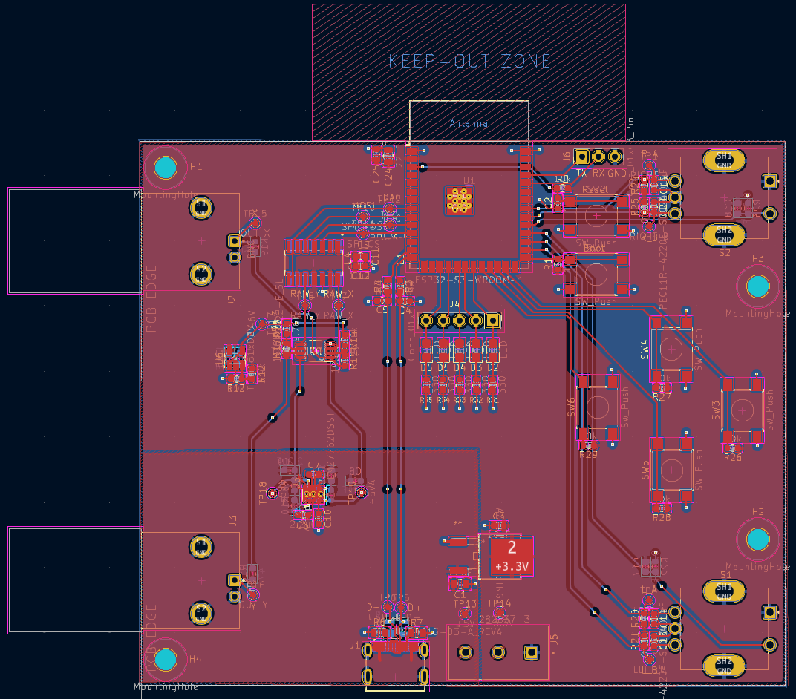

---

# Entry 6
**Date:** 02-26-2026
**Session Duration:** ~3 hours  
**Location:** ECEB

---

During this session, I focused on preparing the PCB and component orders for OscilloSketch. Since the first PCB order deadline was today, my main goal was to carefully look over the PCB layout, make sure it was ready for manufacturing, and generate the files needed to submit the board.

I reviewed the PCB layout for major hardware issues, including component placement, routing, board size, connector placement, and test point locations. This meant using the ERC and DRC. I checked the important sections of the board, including the ESP32-S3, MCP4922 DAC, op-amp output stage, power regulation, USB-C input, and BNC output connections. I also made sure the layout would be reasonable to assemble and debug once the boards arrived.

Josh mentioned also including extra protections for inputs and outputs. So I made sure to include bidirectional TVS diodes for the BNC connections while also adding unidirectional TVS diodes for the USB-C 5V connection. We decided on adding schottky diode to prevent back current from entering the USB-C. 

After reviewing the layout, I converted the PCB design into Gerber and drill files for manufacturing. I then checked the exported files and submitted the PCB order through email. Our TA said to run it in PCB Way to make sure that the PCB is decent which is shown below. 

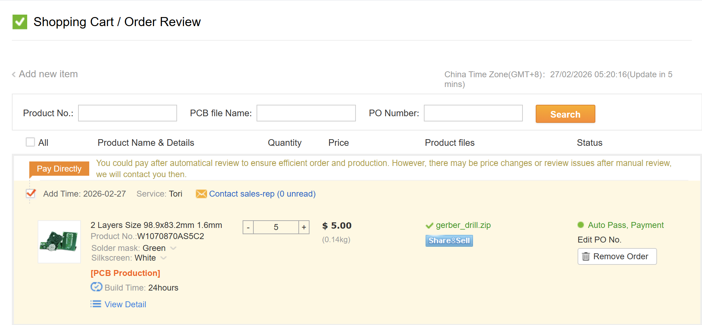

In addition to the PCB order, I also worked on component ordering after submitting the PCB order. I submitted the DigiKey cart [link](https://www.digikey.com/short/01r4fr87) for the main electrical components, including the DAC, op-amps, regulators, USB-C connector, protection parts, rotary encoders, and supporting passives. I also submitted the eShop order for parts that could be sourced through the ECE shop [link](Excel/ECE%20445%20Order%20Form%20Spring%202026%202.24.2026.xlsx).

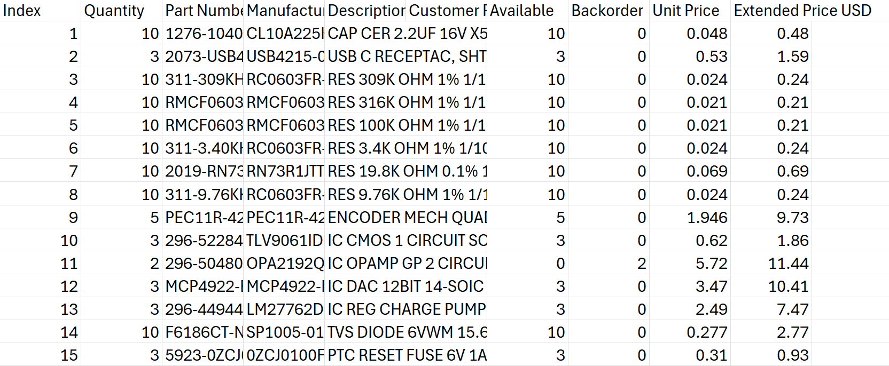

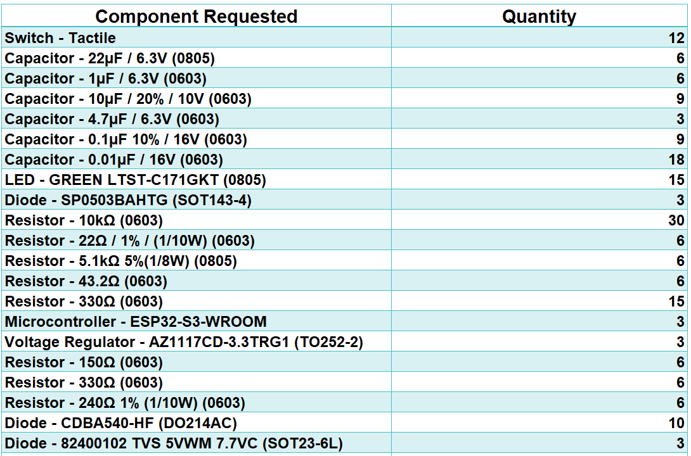

By the end of the session, the PCB layout had been reviewed, the Gerber files had been generated, the PCB order had been submitted, and the DigiKey and eShop orders were completed. This was an important milestone because it moved the project from the design stage into fabrication and parts procurement. Over the week, both me and Josh needs to start working on the breadboard demo and do the design document. 

---

# Entry 7
**Date:** 02-27-2026
**Session Duration:** ~8 hours  
**Location:** Grainger & ECEB

---

Although there was not much going on hardware wise, the design documentation was due tonight and it took me all day. I mainly did the hardware subsystem section where I took screenshots of the schematic and wrote about what it did. I also did the tolerance analysis and cost analysis. Lastly, I made the flowchart for the firmware since we had a vague idea of what we wanted the code to do.

With the design document done, the next thing is working on a breadboard to do a demo and also go to the design review for the instructor and TA. 

---

# Entry 8
**Date:** 03-04-2026
**Session Duration:** ~1 hours  
**Location:** ECEB

---

We went to the design review where Prof. Zhao pointed out that our project was too simple and did not have good enough high level requirements to make this project commplex enough. From there we spent some time thinking about her comments on how to make the project more complex and have more quantitative goals. 

Josh and I agreed to expand on the OscilloSketch to more than just the Etch-e-Sketch. We wanted there to have audio capabilities so user cna have hearing as another method of understanding signals than just visually on the oscilloscope. We also wanted to add Z-Blanking to allow discontinous lines so we can recreate games on the oscilloscope. However, we did not want to jump the gun immediately and would rather get our current board working before implementing more things to it. 

Our task for next week is getting a breadboarding with 2 DAC working. 

---

# Entry 9
**Date:** 03-05-2026
**Session Duration:** ~1 hours  
**Location:** ECEB

---

I made a quick adjustment to the PCB layout and submitted to the 2nd round of PCB since there was a mistake. As shown in the image below, there is the right_button trace is touching one of the ping of the encoder which isn't good. This means when the encoder is spun, that right_button will be triggered too or vise versa. This isn't as intended so I moved the trace over to increase the tolerance. 

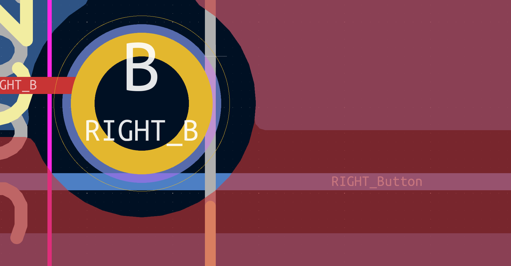

Since the second PCB is going to be the same as the first pcb but without the mistake, we decided that are not going to solder the first pcb. 

---

# Entry 10
**Date:** 03-08-2026
**Session Duration:** ~3 hours  
**Location:** ECEB ECE445 Lab

---

Josh and I met up in the ECE445 Lab to work on the breadboard for the breadboard demo. Unfortunely the DAC with SPI that I ordered from Digikey has not arrived yet so I found 2 12-bit DAC (HI5731 [link](https://www.renesas.com/en/document/dst/hi5731-datasheet?srsltid=AfmBOoobHtNZYDDv4hQf_mYEG8DLXcelq0Uoh03J1XwV2X2RC7qKmwCm)) that uses parallel input in the self service area in the ECEB. This way me and Josh could still demo without our order. 

Josh brought his ESP32-S3 dev board along with 2 rotary encoder so we can simulate what our board will be mainly comprised of. We hooked up the 2 DACs to the same parallel 12 GPIO pins of the dev board but enabled different times in order to save pins. We also used 2 GPIO pins for the rotary encoders. 

When powering up the esp32, I accidently fried Josh's board and so I paid money to get another one for him. This set us back a little since a shorted board means there is a misconnection somewhere. We had to restart from the beginning and rewire everything just to make sure there were on mistakes. 

After a bit of wiring and coding, we were able to draw a heart on the oscilloscope first as a test to see if the DACs were behaving as expected. The image below shows the hear but Then we moved onto using the rotary encoders to draw images on the oscilloscope. 

By the end of the day I also filled out the teamwork evaulation too. 

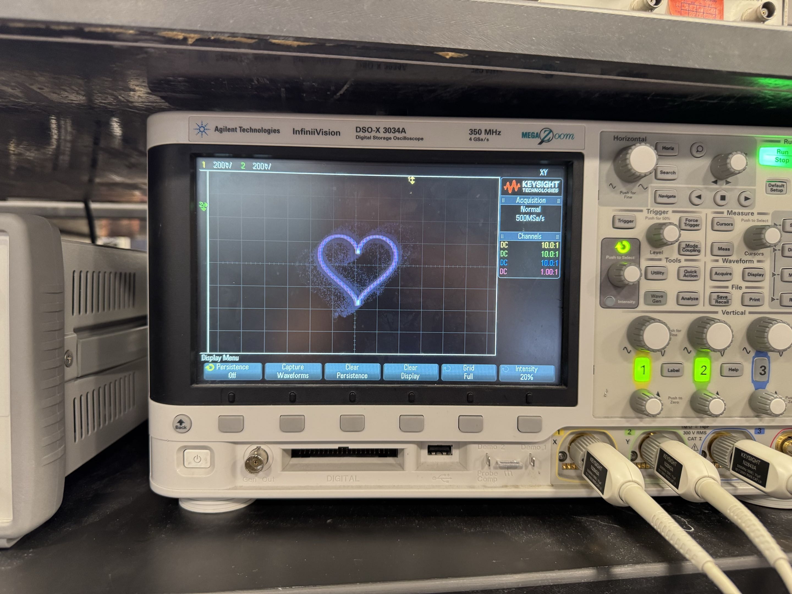

---

# Entry 11
**Date:** 03-11-2026
**Session Duration:** ~1 hours  
**Location:** ECEB ECE445 Lab

---

Josh and I went to demo out breadboard to the professor and it was good. The professor seemed to like that we were planning to add extra functionality beyond the basic requirements, such as preset drawing modes and possible Z-blanking. This gave us more confidence that the project direction was good and that the extra features could make the final demo more interesting.

By the end of the demo, we felt that the project was on track. The next step was to wait for the PCB to arrive so we can start soldering and testing the PCB that was ordered. No PCB has been ordered for the third round. 

---

# Entry 12
**Date:** 03-23-2026
**Session Duration:** ~6 hours  
**Location:** ECEB ECE445 Lab

---

The boards have arrived so I got straight to soldering it. I made sure to pick up both the first and second PCBs along with the components for them. 

I decided to solder it in sections so I can test each of the subsystems individually without ruining the board itself. Like I started on the USB-C to see if it provides 5V and then the LDO to see if it could produce 3.3V. This way I can identify which components or subsystem is broken as I am soldering. By the end of the work session I am able to program the ESP32-S3-WROOM1 with USB-C, the charge pump provides about +-5V and the DAC works in a while loop. 

Since the board is pretty much soldered, I dropped it off to Josh so he could work on the firmware for it. The next thing to work on is to add the audio and z-blanking to the PCB for the last PCB order. 

---

# Entry 13
**Date:** 03-26-2026  
**Session Duration:** ~3 hours  
**Location:** Beakman  

---

As noted from the last entry, I wanted to add the audio output and Z-blanking features to the final version of the PCB. Since the main board was already working, this session focused on improving the design and adding the extra features that would make the final demo more interesting.

For the audio subsystem, I first considered whether we should use a small Class-D amplifier or just output an AUX-level signal. A Class-D amplifier would allow the device to directly drive a speaker, but it would also add more complexity, extra components, and more risk this late in the project. After talking with Josh, we decided that an AUX output made more sense because it was simpler and still allowed us to hear the X/Y signal behavior through an external speaker or audio device.

Since AUX audio should stay below about 1.2 Vrms, I added a voltage divider to reduce the signal amplitude before the audio jack. I also added an AC coupling capacitor so that the audio output would remove the DC offset and only pass the changing part of the signal. This was important because the raw X/Y signals are meant for the oscilloscope and can have a DC offset, but an audio output should be centered around AC behavior instead.

For Z-blanking, I added a third BNC output to the PCB. The goal of Z-blanking is to give the oscilloscope a separate blanking/control signal so that the beam can be turned on and off instead of always drawing continuous lines. This would help with drawing separate shapes or future game-style graphics. Since the ESP32-S3 outputs 3.3 V logic, but Josh’s analog oscilloscope expects around a 0 V to 5 V blanking signal, I added a level shifter to convert the 3.3 V GPIO signal up to 5 V.

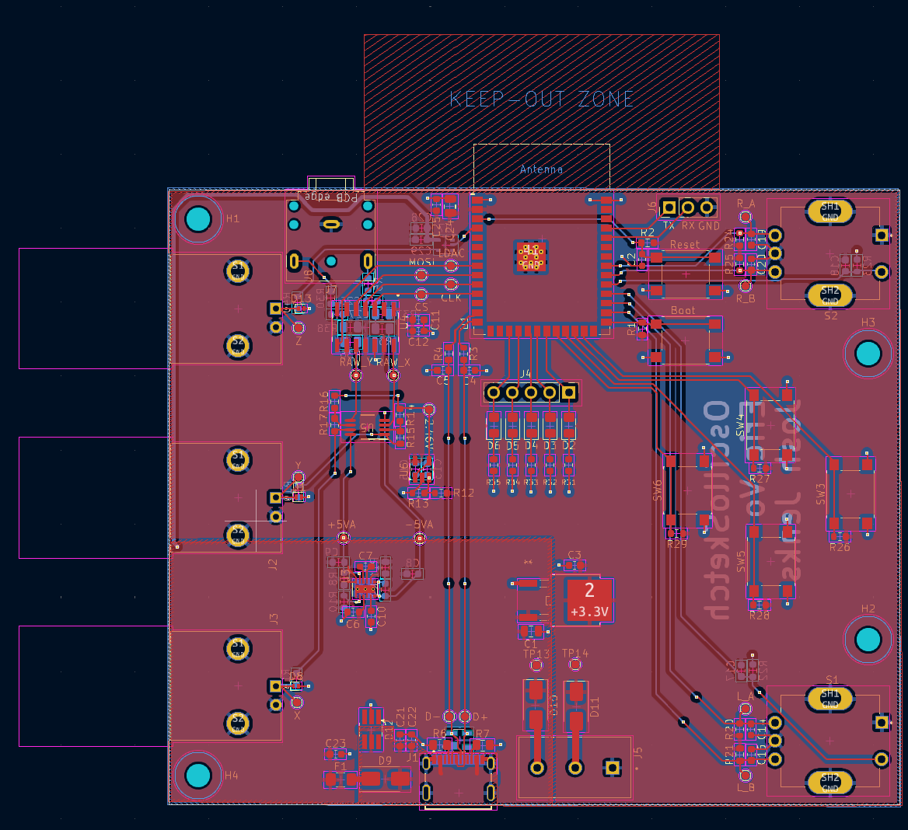

I also updated the PCB layout to include the new audio jack and third BNC connector. This meant checking the placement of the new connectors, routing the new signals, and making sure the board still had enough space for the existing controls, USB-C connector, and analog output circuitry. The final layout now supports X output, Y output, Z-blanking output, and an AUX audio output.

After updating the PCB, I also worked on the parts needed for these new features. I reviewed the DigiKey [link](https://www.digikey.com/short/1v3r45cp) and eShop orders [link](Excel/ECE%20445%20Order%20Form%20Spring%202026%202.24.2026%20(1).xlsx) to make sure the additional components, such as the audio jack, BNC connector, level-shifter parts, resistors, capacitors, and other supporting components, were included.

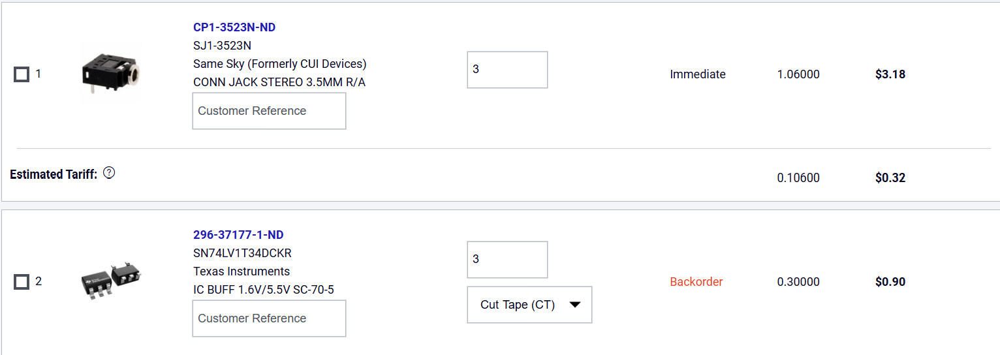

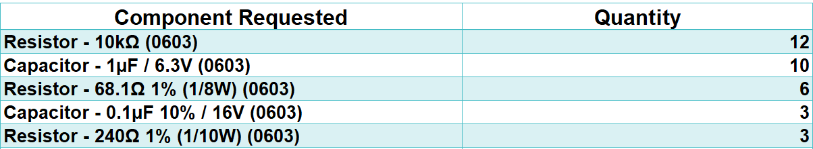

By the end of this session, the final PCB layout included both audio output and Z-blanking support. This was an important update because it expanded the project beyond the basic Etch-a-Sketch X/Y output and gave us more features to show during the final demo.

The next step is to wait for the final PCB to come in so I can solder it and test it, otherwise I should start going through the R&V table to make sure the board works well. 

---

# Entry 14
**Date:** 03-31-2026  
**Session Duration:** ~6 hours  
**Location:** ECEB  

---

I spent the evening working on the individual progress report and mentioned that I worked on the hardware design, PCB layout, soldering, and initial verification for OscilloSketch. Since the report was focused on individual progress, I mainly wrote about the parts of the project that I was responsible for, while also explaining how my hardware work connected to Josh’s firmware work.

In the report, I wrote about the main hardware subsystems, including the ESP32-S3 microcontroller section, user input section, power stage, DAC subsystem, and analog output stage. For each subsystem, I explained the schematic design and PCB layout choices. This included why the ESP32-S3-WROOM-1 was placed near the board edge, why test points were added, how the rotary encoders and buttons were connected, and how the DAC output would be scaled to approximately ±5 V for oscilloscope XY mode.

By the end of the session, I had most of the individual progress report written. This helped organize everything I had completed so far and made it clearer what still needed to be done. At this point, the main hardware was mostly working, so the next step was to keep helping Josh with firmware testing while waiting for the final PCB version with audio and Z-blanking.

---

# Entry 15
**Date:** 04-06-2026  
**Session Duration:** ~1 hour  
**Location:** ECEB ECE445 Lab  

---

Josh and I completed the progress demo for OscilloSketch. For this demo, we mainly showed the same core functionality that we had demonstrated during the breadboard demo, but this time it was running on our actual PCB instead of the temporary breadboard setup.

The next step was to continue implementing the firmware modes, refine the user controls, and prepare the final PCB version with audio output and Z-blanking.

---

# Entry 16
**Date:** 04-09-2026  
**Session Duration:** ~1 hour  
**Location:** Off-campus, Shell Eco-marathon trip

---

Just had to complete and submit the team contract assessment while working on EV Concept at the Shell Eco Marathon. I could not contribute much this week but since Josh has the PCB, he can do as much firmware as he wants. 

Once I get back, I plan on soldering the final PCB since it has arrived and then give it to Josh for audio and z-blanking. 

---

# Entry 17
**Date:** 04-13-2026  
**Session Duration:** ~4 hours  
**Location:** ECEB ECE445 Lab

---

During this session, I started soldering the new final PCB for OscilloSketch. This board included the original working sections from the previous PCB, along with the added audio output and Z-blanking circuits. Since this was one of the final PCB versions, I also had to be careful with the remaining components and supplies because we were starting to use up the last of some parts from DigiKey and the ECE shop.

Because I already knew that the majority of the original PCB design worked, I soldered more of the known sections at a time compared to the first bring-up. For example, the USB-C power input, 3.3 V regulator, ESP32-S3, DAC, and analog output sections were mostly copied from the previous working board, so I was more confident assembling them. Even though I soldered more at once, I still tested the board in stages to make sure the expected rails and basic functionality were working before moving on.

For the newer sections of the PCB, I worked more carefully. This included the audio output circuit and the Z-blanking output circuit, since those had not been tested on the previous board. I checked the component values, orientation, and routing more carefully before soldering them. The audio section needed the voltage divider and AC coupling capacitor, while the Z-blanking section needed the level shifter to convert the ESP32’s 3.3 V GPIO signal to a 5 V output for the oscilloscope.

By the end of the session, I finished assembling the PCB. The older sections of the design were soldered and checked first, while the newer audio and Z-blanking sections were assembled more carefully since they were new additions. I was able to plug my headphones into the jack and could hear the sin wave I set the code to do, so I dropped the board off to Josh for programming. 
 
The next step is to test the power rails, verify USB programming, check the DAC and analog outputs for the R&V table.

---

# Entry 18
**Date:** 04-21-2026  
**Session Duration:** ~1 hours  
**Location:** ECEB ECE445 Lab

---

Josh and I completed the mock demo for OscilloSketch. For this demo, we got the final board working and showed that the main system was close to final demo ready.

We demonstrated three working modes: Etch-a-Sketch mode, demo shapes such as a circle and square, and Pong. Z-blanking was also working, which helped make the drawings and game mode look cleaner because the oscilloscope did not have to draw every connecting line.

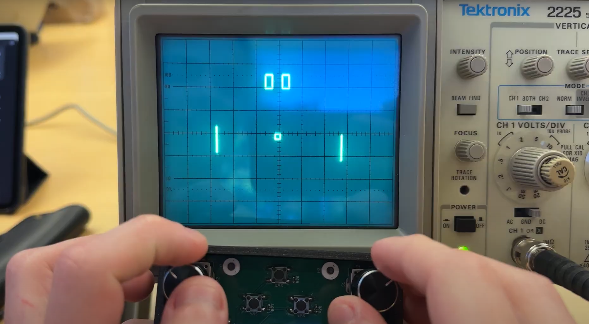

Audio was still in progress, but we had the low-pass and high-pass filter behavior working. The TAs seemed happy with the progress and thought the project was cool.

The next step is to keep refining the firmware, finish audio testing, and prepare the system for the final demo.

---

# Entry 19
**Date:** 04-24-2026  
**Session Duration:** ~4 hours  
**Location:** ECEB ECE445 Lab & Civil Engineering Building

---

Josh and I completed the mock presentation for OscilloSketch. Overall, the presentation went well, and the TA gave us good feedback on what to improve before the final presentation. The TA generally seemed to enjoy the project and thought the oscilloscope drawing, Z-blanking, and game/demo modes were interesting.

Later that night, Josh and I spent more time working in the Civil Engineering Building to continue improving the firmware. We focused on cleaning up the demo behavior and making the modes work more reliably for the final demo. Since the hardware was mostly working, the main goal was to make the user experience smoother and make sure the final demo would run consistently.

By the end of the night, we had a better idea of what needed to be fixed before the final demo and presentation.

The next step is to keep refining the firmware, finish the final demo setup, and update the presentation based on the TA’s feedback.

---

# Entry 20
**Date:** 04-26-2026  
**Session Duration:** ~5 hours  
**Location:** ECEB ECE445 Lab

---

I spent time in the lab checking the Requirements and Verification table and filling out results for the main subsystems. Since the final demo and report were coming up, I wanted to collect enough evidence to support our verification results. I took photos and videos of the board, oscilloscope outputs, multimeter readings, and signals that I probed.

For the power subsystem, I checked the USB-C 5 V input, the 3.3 V regulator output, and the positive and negative analog rails from the charge pump. These rails are important because they power the ESP32-S3, DAC, and op-amp output stage.

For the microcontroller and user input subsystems, I verified that the ESP32-S3 could still be programmed and that the firmware detected the rotary encoders and buttons. I also recorded videos showing that turning the encoders changed the oscilloscope drawing.

For the DAC and analog output subsystems, I tested simple DAC output values and measured the raw DAC signals before the op-amp stage. Then I measured the final X and Y BNC outputs to check that they were centered near 0 V and had enough voltage swing for a clear XY display.

I also probed timing signals such as LDAC and SPI to help verify that the update rate was fast enough for smooth drawing. For the newer audio and Z-blanking features, I started checking that the audio signal was reduced and AC-coupled, and that the Z-blanking GPIO signal was level shifted from 3.3 V to 5 V.

By the end of the session, I had filled in more of the R&V table and collected photo/video evidence for the final report and presentation.

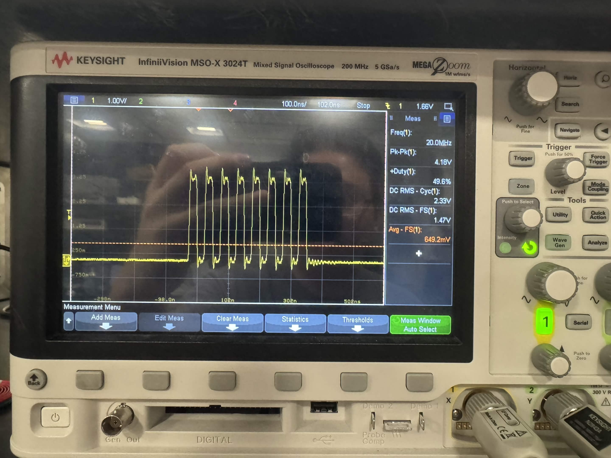

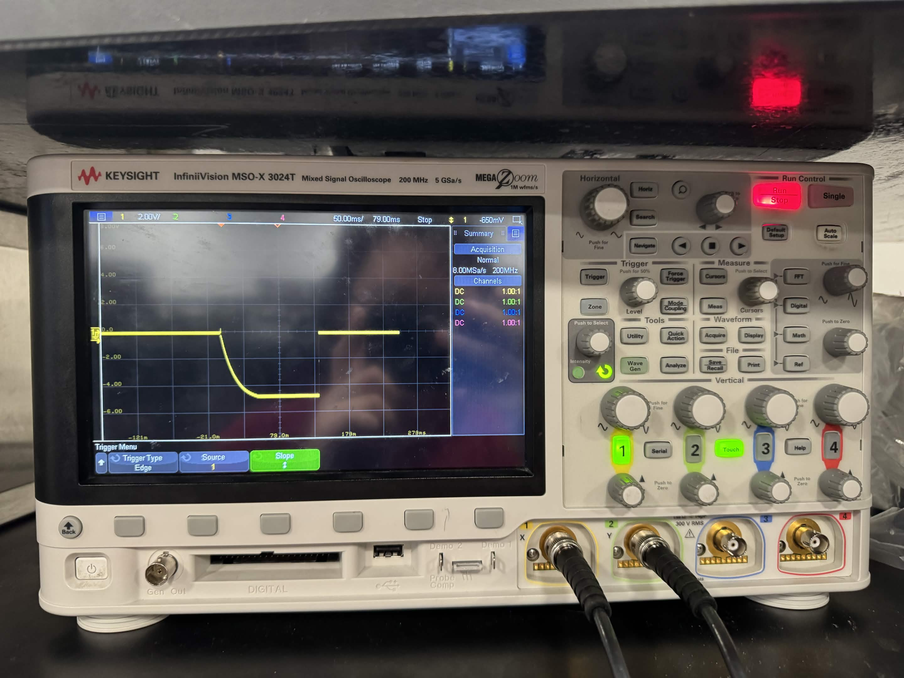

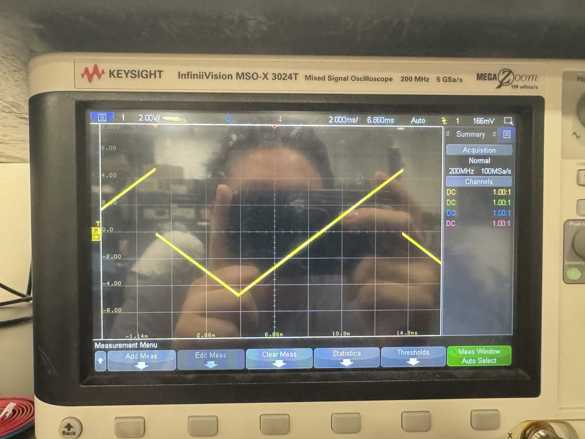

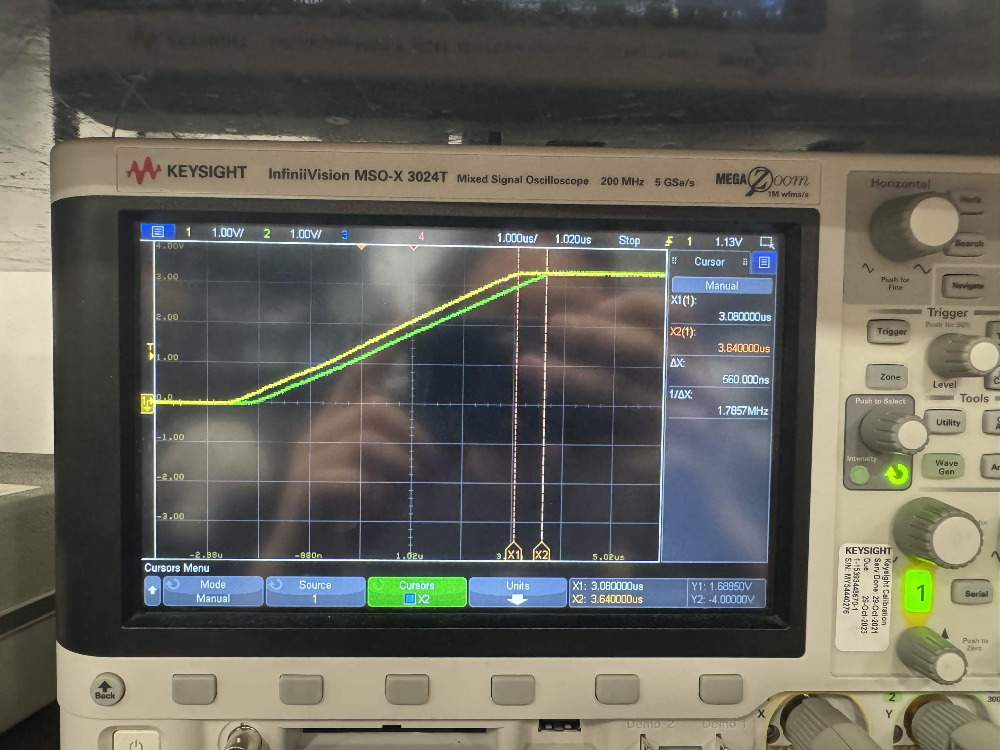

The next step is to organize the photos and oscilloscope screenshots, finish any missing measurements, and use the results in the final report.

---

# Entry 21
**Date:** 04-28-2026  
**Session Duration:** ~1 hour  
**Location:** ECEB ECE445 Lab  

---

Josh and I completed the final demo for OscilloSketch in the morning. We started by showing the block diagram and R&V table to explain the overall system and how we verified the main requirements.

During the demo, we showcased all of the working modes, including Etch-a-Sketch, preset shapes, and Pong with Z-blanking. We also showed the audio feature, but explained that it was still a work in progress.

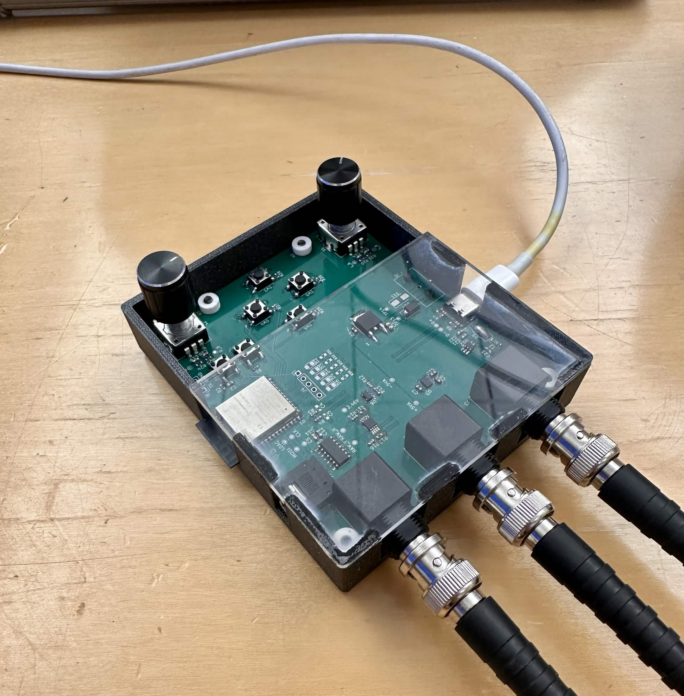

Overall, I was satisfied with the final demo because the main hardware and firmware features worked and we were able to show the full project clearly.

---

# Entry 22
**Date:** 05-05-2026  
**Session Duration:** ~2 hours  
**Location:** ECEB / Presentation Room  

---

Josh and I completed the final presentation for OscilloSketch. The day before, we practiced the presentation a few times so that we could make sure the slides flowed well and that we were comfortable explaining our parts.

During the final presentation, we explained the motivation of the project, the system block diagram, the main hardware and firmware subsystems, and the verification results. For my part, I focused more on the hardware side, including the PCB design, power system, DAC subsystem, analog output stage, BNC outputs, audio output, and Z-blanking circuit.

We also showed a few demo videos and discussed the working modes, including Etch-a-Sketch, preset shapes, Pong, and audio. Overall, the presentation went well, and I felt satisfied with how we summarized the full project.

---

# Entry 23
**Date:** 05-06-2026  
**Session Duration:** ~9 hours  
**Location:** Siebel Center of Design  

---

Josh and I spent most of the day working on the final report for OscilloSketch. Since the project was already demoed and presented, the goal was to organize everything we had completed into one final document.

We worked on cleaning up the report sections, adding verification results, updating figures, writing captions, and making sure the hardware and firmware descriptions matched the final version of the project. I focused more on the hardware-related sections, including the PCB design, power system, DAC subsystem, analog output stage, audio output, Z-blanking, cost analysis, and verification results.

We also reviewed the R&V table and added measurements from the final board, including output range, centering, update timing, and oscilloscope screenshots. This took a long time because we wanted the report to clearly show what worked and how each requirement was verified.

By the end of the session, the final report was mostly completed and ready for final edits before submission.

