# ECE 445 Lab Notebook
**Name:** Josh Jenks  
**Project:** OscilloSketch / Handheld Oscilloscope XY Controller  
**Semester:** Spring 2026  

---

# Entry 1
**Date:** 2026-01-20  
**Session Duration:** ~1 hour  
**Location:** ECEB / text discussion with Eric  

---

## 1. Objectives

- Start brainstorming possible ECE 445 project ideas.
- Identify project directions that would be interesting, realistic, and hardware/software balanced.
- Decide what kind of project scope would be appropriate for the course.

---

## 2. Work Performed

Eric and I discussed possible project directions after the first senior design class. At this point, the goal was not to lock a design, but to get a list of realistic ideas that we could refine. We wanted something that was more interesting than a very basic sensor project, but also not so complex that the PCB and debugging would become impossible in one semester.

Ideas discussed included:

- Analog oscilloscope Etch-a-Sketch / oscilloscope game.
- Bicycle lane-assist warning system.
- Automatic plant monitoring / watering system.
- Laser tag wand.
- Minecraft-style compass.
- Automatic page turner for sheet music.

The oscilloscope idea stood out because it had a clear mix of analog hardware, embedded firmware, PCB layout, and visual demonstration. I described it as an analog oscilloscope Etch-a-Sketch game, with possible older arcade/game functionality like Pong on the oscilloscope. This became the first serious form of the project idea.

---

## 3. Design Reasoning

The key reason this idea seemed strong was that oscilloscope XY mode creates a direct mapping between two analog voltages and a 2D display position:

\[
X(t) \rightarrow \text{horizontal deflection}
\]

\[
Y(t) \rightarrow \text{vertical deflection}
\]

So, if we could generate controlled X and Y voltages from a microcontroller and DAC, the oscilloscope could act like a vector display. This gave the project a simple visible output while still requiring real mixed-signal design.

Compared with the other ideas, OscilloSketch had stronger demonstration value and more interesting electrical engineering content. The bike warning project had a more practical safety application, while the plant watering project was simpler and more sensor/control focused. The oscilloscope idea had more technical uniqueness and better matched what we wanted to learn.

---

## 4. Decisions Made

- Oscilloscope XY drawing/game concept became the leading project candidate.
- We agreed that the project should still keep requirements achievable, with extra features treated as stretch goals.
- We planned to continue narrowing the idea and prepare a more formal proposal.

---

## 5. Next Steps

- Determine whether the course would accept a project whose main purpose is interactive visualization / education rather than a direct societal need.
- Develop the oscilloscope idea into a formal problem, solution, and subsystem breakdown.
- Identify likely major components such as MCU, DAC, op-amps, input controls, and power supply.

---

# Entry 2
**Date:** 2026-01-21  
**Session Duration:** ~1.5 hours  
**Location:** Siebel Center, in-person meeting with Eric  

---

## 1. Objectives

- Meet in person to narrow project ideas.
- Compare project difficulty and course fit.
- Decide whether the oscilloscope XY controller should become our formal proposal.

---

## 2. Work Performed

Eric and I met in person at Siebel to discuss the project ideas from the previous day. We talked through the practical strengths and weaknesses of the possible ideas. The main comparison was between simpler automation/sensor projects and the oscilloscope XY controller.

The oscilloscope idea continued to look best because it could be divided into clear subsystems:

- User input using knobs/buttons.
- Microcontroller and firmware.
- DAC output generation.
- Analog scaling and protection.
- USB-C powered board.
- Optional game/audio/Z-blanking features.

We also discussed course strategy. The project needed to be ambitious enough to be respectable, but the formal requirements should still be achievable. The high-risk features should be optional or stretch goals so that the base project could still pass even if those features took longer than expected.

---

## 3. Engineering Process

At this point, the likely base system was:

User input → MCU → DAC → op-amp scaling → oscilloscope X/Y inputs

The biggest technical risks identified were:

- Generating stable bipolar voltages from a USB-powered system.
- Updating the X/Y outputs fast enough that the oscilloscope image appears stable.
- Protecting the oscilloscope input from accidental overvoltage or excessive current.
- Making the user interface responsive enough to feel like a real drawing controller.

No exact part numbers were finalized in this meeting. The purpose was mainly to decide whether the idea was worth developing into the formal proposal.

---

## 4. Decisions Made

- We decided to move forward with the oscilloscope XY controller idea.
- The initial device concept would be an Etch-a-Sketch-style controller using two rotary encoders.
- Pong / Asteroids / audio output / Z-blanking would be treated as possible stretch goals.

---

## 5. Next Steps

- Write the official project proposal.
- Define the project problem and solution in a way that sounds technically defensible.
- Choose candidate components for the MCU, DAC, analog stage, and power subsystem.

---

# Entry 3
**Date:** 2026-01-27  
**Session Duration:** ~3 hours  
**Location:** ECEB + remote proposal writing  

---

## 1. Objectives

- Finalize and submit the official project proposal.
- Define the initial high-level system architecture.
- Decompose the project into engineering subsystems.
- Decide which features are base requirements and which are stretch goals.

---

## 2. Work Performed

We wrote the first formal version of the OscilloSketch proposal. The project was framed as a handheld device that connects to an oscilloscope in XY mode and generates synchronized X and Y analog outputs. The main user interaction was based on an Etch-a-Sketch, where two rotary encoders independently control the X and Y position.

The initial proposed architecture was:

User Input (Rotary Encoders + Buttons)  
→ Microcontroller  
→ Dual-Channel DAC  
→ Analog Filtering / Level Shifting / Buffering  
→ Bipolar X/Y BNC Outputs  
→ Oscilloscope XY Mode

The proposal also included a USB-C power subsystem and output protection so the device could be safely connected to lab oscilloscopes.

---

## 3. Subsystem Definition

The system was divided into these main subsystems:

1. **User Input / UI**
   - 2 rotary encoders with push switches.
   - 4 tactile pushbuttons.
   - Optional status LEDs.

2. **Microcontroller + Firmware**
   - MCU reads inputs, stores drawing state, and generates X/Y sample streams.
   - Firmware needs quadrature decoding, button debouncing, and a timer-driven DAC update path.

3. **Dual-Channel DAC + Analog Output Chain**
   - External dual-channel 12-bit DAC.
   - Op-amp signal conditioning to shift 0–3.3 V DAC output into a bipolar scope-compatible range.
   - BNC output connectors.
   - Output protection/current limiting.

4. **Power Regulation**
   - USB-C 5 V input.
   - 3.3 V digital rail.
   - Generated negative rail for bipolar output.

5. **Stretch Goals**
   - Z-axis blanking.
   - Line-level audio output.
   - Pong / Asteroids style vector game modes.

---

## 4. Design Reasoning

We discussed whether to use an ESP32-class MCU or an STM32-class MCU. STM32 would likely be more deterministic if using timers/DMA correctly, but it would also increase firmware setup difficulty. The ESP32 path seemed more realistic for getting a working prototype quickly because the development environment is easier and there is more Arduino/USB/serial support.

We also discussed the audio output. Instead of adding a small speaker as a required feature, we decided that a 3.5 mm auxiliary output would be more flexible and should remain a stretch goal. This avoided making audio amplification a required part of the base project.

For portability, we also realized the device could be powered from a normal USB-C wall adapter or even a USB power bank. That meant we did not need to add an internal battery for the first revision.

---

## 5. Decisions Made

- Submitted OscilloSketch as the team project proposal.
- Chose external dual-channel DAC architecture rather than relying on MCU analog outputs.
- Treated ESP32 vs STM32 as an open decision, but leaned toward ESP32 for development speed.
- Kept audio output and vector game features as stretch goals.
- Defined USB-C power as the main power input.

---

## 6. Next Steps

- Wait for project approval / feedback.
- Create a more formal block diagram.
- Select concrete components for MCU, DAC, op-amps, and power regulation.
- Start turning the proposal into a design document.

---

# Entry 4
**Date:** 2026-02-10  
**Session Duration:** ~3 hours  
**Location:** In-person team meeting  

---

## 1. Objectives

- Create a more formal proposal package.
- Produce a refined system block diagram.
- Define high-level system goals.
- Establish subsystem-level requirements.
- Perform preliminary power and output-resolution checks.

---

## 2. Work Performed

We created the first formal block diagram for the project. This diagram connected the USB-C power input, power subsystem, MCU subsystem, UI subsystem, dual 12-bit DAC, analog output stage, and X/Y BNC connectors.

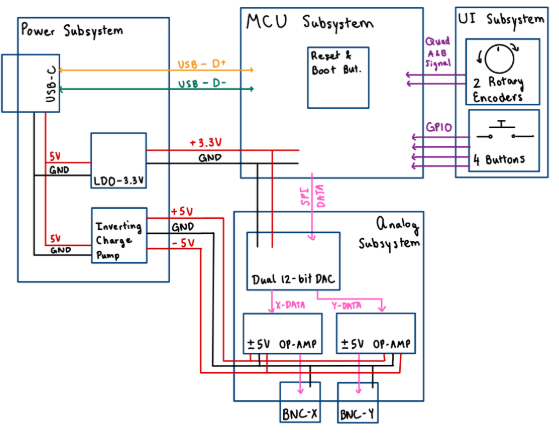

The diagram helped clarify the main signal paths:

- USB D+/D− for programming the ESP32.
- SPI from MCU to DAC.
- Quadrature encoder signals to MCU GPIO.
- Button GPIO inputs.
- DAC raw X/Y analog outputs into op-amp stages.
- Final X/Y outputs to BNC connectors.

---

## 3. High-Level Goals

We defined three high-level goals:

1. **Functional Output**  
   The system shall generate two independent, user-configurable analog output signals suitable for visualization on an external oscilloscope.

2. **Real-Time User Interaction**  
   The system shall allow the user to adjust waveform/drawing parameters in real time using on-device controls without interrupting or destabilizing signal generation.

3. **Single-Cable Operation**  
   The system shall operate from a single USB-C connection, providing both power and programming access without requiring external supplies during normal use.

---

## 4. Preliminary Engineering Checks

### 4.1 DAC Resolution

The intended output span is approximately ±5 V, or 10 V total.

For a 12-bit DAC:

\[
2^{12} = 4096 \text{ codes}
\]

\[
\Delta V = \frac{10V}{4096} \approx 2.44mV/code
\]

This is small enough for smooth visual motion on an oscilloscope display. A 16-bit DAC would give about:

\[
\Delta V_{16} = \frac{10V}{65536} \approx 0.153mV/code
\]

That extra resolution did not seem necessary for a visual XY drawing device, and would increase cost and interface complexity.

### 4.2 Preliminary Current Estimate

Estimated peak load:

- ESP32-S3: roughly 200–240 mA peak with RF disabled.
- DAC: roughly 5–10 mA.
- Op-amps: roughly 10–20 mA.
- UI passives/buttons: negligible.

\[
I_{est} \approx 260mA \text{ to } 300mA
\]

Adding 30% margin:

\[
I_{required} \approx 1.3 \cdot 300mA = 390mA
\]

So the 3.3 V regulator should be rated comfortably above 500 mA.

---

## 5. Decisions Made

- Approved the initial system block diagram for the formal proposal.
- Decided that 12-bit DAC resolution is sufficient for the first PCB revision.
- Confirmed that the 3.3 V rail must support at least several hundred mA of peak current.
- Defined base subsystem requirements for power, MCU, analog output, and UI.

---

## 6. Next Steps

- Move from block diagram to schematic capture.
- Select final MCU, DAC, op-amp, power, and protection components.
- Refine the power subsystem and analog output transfer function.

---

# Entry 5
**Date:** 2026-02-12  
**Session Duration:** ~2 hours  
**Location:** Remote design discussion  

---

## 1. Objectives

- Refine the power subsystem.
- Decide how to generate the analog rails needed for bipolar output.
- Make the proposal language more realistic around voltage range.

---

## 2. Work Performed

We reviewed the issue of generating a true bipolar output from a USB-powered device. Since USB-C gives us 5 V input, the board needs a way to generate a negative supply rail for the op-amp output stage. Without a negative rail, the output could not swing below ground, making true ± output impossible.

We moved toward using the LM27762 regulated charge pump for the analog supply rails. This part can generate both positive and negative analog rails and does not require an inductor, which keeps the design smaller and simpler than a switching converter. The main purpose of this part is to supply the op-amp stage, not the high-current digital logic.

We also refined the wording around the analog output range. Instead of promising exactly ±5.000 V under all conditions, the project should claim an output range near ±5 V or approximately ±5 V. This is more honest because op-amp rail headroom, charge pump behavior, resistor tolerances, and USB input voltage variation all affect the exact output swing.

---

## 3. Design Reasoning

The analog stage needs both positive and negative rails so that the BNC output can be centered around 0 V. The desired final mapping is approximately:

\[
V_{DAC}=0V \rightarrow V_{out}\approx -5V
\]

\[
V_{DAC}=1.65V \rightarrow V_{out}\approx 0V
\]

\[
V_{DAC}=3.3V \rightarrow V_{out}\approx +5V
\]

This means the analog output stage needs enough headroom above and below ground to produce both polarities. A generated negative rail is therefore not optional for the main project goal.

---

## 4. Decisions Made

- Use a charge-pump-based bipolar analog rail approach.
- Keep the output voltage requirement phrased as approximately ±5 V / near ±5 V.
- Continue using USB-C 5 V as the only normal power input.
- Keep the 3.3 V digital regulator separate from the analog rail generation.

---

## 5. Next Steps

- Finalize specific rail-generation component values.
- Start schematic capture for USB-C input, 3.3 V rail, charge pump, and analog output stage.
- Continue selecting exact components for the PCB.

---

# Entry 6
**Date:** 2026-02-16  
**Session Duration:** ~1.5 hours  
**Location:** Remote / VS Code / GitHub setup discussion  

---

## 1. Objectives

- Decide how to maintain the required lab notebook.
- Set up a digital notebook workflow.
- Begin reconstructing early project entries while information was still available.

---

## 2. Work Performed

We reviewed the ECE 445 lab notebook requirements and decided to keep a digital notebook in Markdown using GitHub. This is easier to maintain than a physical notebook and gives a commit history, which works as the digital equivalent of permanent chronological records.

The chosen format was one Markdown file per person:

- `Notebooks/Josh's/Joshs_notebook.md`
- Eric has his own notebook file.

This single-file approach makes it easier to search with Ctrl+F and resembles a physical bound notebook more than many separate files. We also decided that figures/images would be saved in the same notebook folder so image links would be simple.

---

## 3. Notebook Format Decisions

The basic entry format was:

- Date
- Session duration
- Location
- Objectives
- Work performed
- Testing / observations where relevant
- Decisions made
- Next steps

For engineering sessions, I planned to include equations, diagrams, figures, raw measurements, and code references where useful. I also noted that AI assistance should be acknowledged in entries where ChatGPT helped generate or refactor code. The code still needs to be tested and understood by me before being treated as project work.

---

## 4. Decisions Made

- Use GitHub + Markdown for the lab notebook.
- Keep one notebook file per person.
- Store images in the same folder as the Markdown file when possible.
- Begin backfilling early entries from actual project discussions and timestamps.

---

## 5. Next Steps

- Add early proposal and block diagram entries.
- Continue keeping entries regularly as design, PCB, breadboard, firmware, and demo work progresses.
- Commit notebook updates to GitHub for history.

---

# Entry 7
**Date:** 2026-02-19  
**Session Duration:** ~2 hours  
**Location:** Remote schematic/component discussion  

---

## 1. Objectives

- Continue choosing final components.
- Confirm the MCU package/module decision.
- Add more concrete functionality goals for the proposal/design document.
- Review firmware/demo modes that could be implemented later.

---

## 2. Work Performed

We discussed using the ESP32-S3-WROOM module as the MCU instead of a bare ESP32-S3 chip. The module approach is much safer for the PCB because the RF module, flash, and support circuitry are already handled. It also improves the chance that the board can be programmed and brought up quickly.

We also discussed additional modes beyond the base Etch-a-Sketch drawing. A preset pattern / shape mode was added as a realistic goal because it would let us test deterministic X/Y output without relying on encoder input. This would be useful both for debugging and for demonstrations.

Possible preset patterns included:

- Square / box.
- Circle.
- Sine / Lissajous-like shapes.
- Heart pattern.

The goal was to have at least one generated pattern to prove the DAC and analog output could make stable coordinated waveforms.

---

## 3. Design Reasoning

A preset shape mode is useful because it separates output-generation testing from input-handling testing. If the preset shape looks wrong, the issue is likely in timing, DAC output, analog scaling, or oscilloscope setup. If the preset shape works but Etch mode does not, the issue is more likely in input decoding or path storage.

This gives the firmware a better debug sequence:

1. Static DAC output.
2. Simple X/Y sweep.
3. Preset shape.
4. Encoder-controlled drawing.
5. More complex modes like Pong or audio.

---

## 4. Decisions Made

- Use ESP32-S3-WROOM as the MCU module for the PCB.
- Add preset shape mode as a planned firmware mode.
- Keep Pong and audio as additional features after base drawing works.
- Continue using ESP32-S3 because it reduces software bring-up risk compared with STM32/DMA.

---

## 5. Next Steps

- Finish schematic review for MCU pinout, DAC interface, and input controls.
- Continue rail and analog output calculations.
- Start preparing design document material.

---

# Entry 8
**Date:** 2026-02-20  
**Session Duration:** ~3 hours  
**Location:** Remote schematic review  

---

## 1. Objectives

- Review power schematic details.
- Calculate LM27762 feedback resistor values.
- Verify that the analog rail targets are close to ±5 V.
- Continue schematic preparation for PCB layout.

---

## 2. Work Performed

We reviewed the LM27762 charge pump rail-setting equations and adjusted resistor values for the positive and negative rails. The goal was to make the analog op-amp rails as close as practical to ±5 V.

For the positive rail, the LM27762 uses approximately:

\[
V_{OUT+}=V_{FB+}\left(1+\frac{R_{TOP}}{R_{BOT}}\right)
\]

Using:

\[
V_{FB+}=1.2V,\ R_{TOP}=316k\Omega,\ R_{BOT}=100k\Omega
\]

\[
V_{OUT+}=1.2\left(1+\frac{316k}{100k}\right)=1.2(4.16)=4.992V
\]

For the negative rail:

\[
V_{OUT-}=V_{FB-}\left(1+\frac{R_{TOP}}{R_{BOT}}\right)
\]

Using:

\[
V_{FB-}=-1.22V,\ R_{TOP}=309k\Omega,\ R_{BOT}=100k\Omega
\]

\[
V_{OUT-}=-1.22\left(1+\frac{309k}{100k}\right)=-1.22(4.09)=-4.99V
\]

---

## 3. Observations

The important thing here was that the positive and negative feedback equations do not use exactly the same feedback reference. The positive reference is about +1.2 V and the negative reference is about −1.22 V, which is why the resistor values are not exactly identical.

This was also a useful checkpoint before PCB layout because the charge pump rails directly determine whether the op-amp stage has enough headroom for the final output swing.

---

## 4. Decisions Made

- Use 316 kΩ / 100 kΩ for the positive rail feedback network.
- Use 309 kΩ / 100 kΩ for the negative rail feedback network.
- Keep test points on the analog rails for later measurement.
- Continue with the LM27762 as the bipolar rail generation part.

---

## 5. Next Steps

- Finish schematic for USB-C protection, LDO, charge pump, MCU, DAC, and analog output.
- Move toward PCB layout.
- Begin writing design document sections for power and analog subsystems.

---

# Entry 9
**Date:** 2026-02-24  
**Session Duration:** ~3 hours  
**Location:** Remote / KiCad and design document work  

---

## 1. Objectives

- Prepare for PCB ordering and design document deadlines.
- Review the analog output transfer function.
- Verify the op-amp resistor values for mapping DAC voltage to BNC output voltage.
- Begin documenting the physical design and cost information.

---

## 2. Work Performed

We reviewed the analog output stage. The DAC outputs a unipolar 0–3.3 V signal, but the oscilloscope needs a bipolar signal centered around 0 V. Therefore, the op-amp stage must both amplify and shift the DAC output.

The chosen level-shifted non-inverting amplifier transfer function was:

\[
V_{out}=\left(1+\frac{R_f}{R_{ref}}\right)V_{in}-\left(\frac{R_f}{R_{ref}}\right)V_{ref}
\]

Using:

\[
R_f=19.8k\Omega
\]

\[
R_{ref}=9.76k\Omega
\]

\[
V_{ref}\approx2.4627V
\]

This gives:

\[
\frac{R_f}{R_{ref}}=\frac{19.8}{9.76}=2.0287
\]

\[
V_{out}=3.0287V_{in}-4.996
\]

So:

\[
V_{in}=0V \rightarrow V_{out}\approx -4.996V
\]

\[
V_{in}=1.65V \rightarrow V_{out}\approx 0V
\]

\[
V_{in}=3.3V \rightarrow V_{out}\approx +4.999V
\]

---

## 3. Design Reasoning

This was one of the most important analog design checks. If the output transfer function was wrong, the oscilloscope image would be incorrectly centered or scaled. The design must map DAC midscale to approximately 0 V so that the drawing starts near the center of the screen.

Effective resolution after analog gain:

\[
\Delta V_{DAC}=\frac{3.3V}{4096}=0.806mV/code
\]

\[
\Delta V_{out}=0.806mV \cdot 3.0287=2.44mV/code
\]

This matched the earlier 12-bit resolution estimate and confirmed that the output stage would preserve smooth enough motion.

---

## 4. Decisions Made

- Use the 19.8 kΩ / 9.76 kΩ gain ratio for the X and Y output stages.
- Use a buffered 2.46 V reference for level shifting.
- Include the transfer function math in the design document.
- Continue with the OPA2192 dual op-amp for the main analog output stage.

---

## 5. Next Steps

- Finalize the output protection values.
- Finish the PCB layout.
- Prepare schematic/PCB figures for the design document.

---

# Entry 10
**Date:** 2026-02-25  
**Session Duration:** ~2.5 hours  
**Location:** Remote schematic and protection review  

---

## 1. Objectives

- Review output protection for the BNC connectors.
- Decide series output resistor value.
- Verify that accidental 50 Ω loading would not create excessive output current.

---

## 2. Work Performed

We reviewed the protection plan for the oscilloscope-facing BNC outputs. The intended oscilloscope input is 1 MΩ, so the series output resistor has almost no effect during normal operation. However, if someone accidentally connects the output to a 50 Ω terminated input or shorts the output, the op-amp should not be forced to source/sink unsafe current.

We discussed using a larger BNC series resistor than the initial ~47–50 Ω value. The final direction was to use 220 Ω in series with each BNC output to improve fault tolerance.

Worst-case approximate current into a 50 Ω termination at 5 V:

\[
R_{total}=220\Omega+50\Omega=270\Omega
\]

\[
I=\frac{5V}{270\Omega}=18.5mA
\]

This is much safer than directly driving a 50 Ω load from the op-amp, and it still has negligible effect with the intended 1 MΩ oscilloscope input.

---

## 3. Design Reasoning

The tradeoff is output impedance vs protection. A smaller resistor gives slightly better drive behavior into low impedance, but our intended load is high impedance. Since the Tektronix 2225 oscilloscope input is high impedance in normal use, protecting the output matters more than maximizing low-impedance drive capability.

The BNC outputs also include bidirectional TVS/clamp protection to reduce risk from ESD or cable transients. Since the signal swings both positive and negative, the protection must work for both polarities.

---

## 4. Decisions Made

- Use 220 Ω series resistors at the X/Y BNC outputs.
- Include TVS/clamp protection at the user-accessible analog outputs.
- Treat 1 MΩ oscilloscope input as the normal operating condition.
- Document 50 Ω loading as a reasonable misuse case.

---

## 5. Next Steps

- Update schematic/PCB values.
- Finish design document protection and safety discussion.
- Prepare PCB order after layout review.

---

# Entry 11
**Date:** 2026-02-27  
**Session Duration:** ~4 hours  
**Location:** Remote / KiCad and design document work  

---

## 1. Objectives

- Finalize design document content.
- Prepare PCB order and parts order.
- Generate design figures for the document.
- Document cost and schedule estimates.

---

## 2. Work Performed

We finished major design document sections including the physical design, block diagram, subsystem descriptions, requirements and verification tables, tolerance analysis, cost, and schedule.

Relevant design figures prepared or updated included:

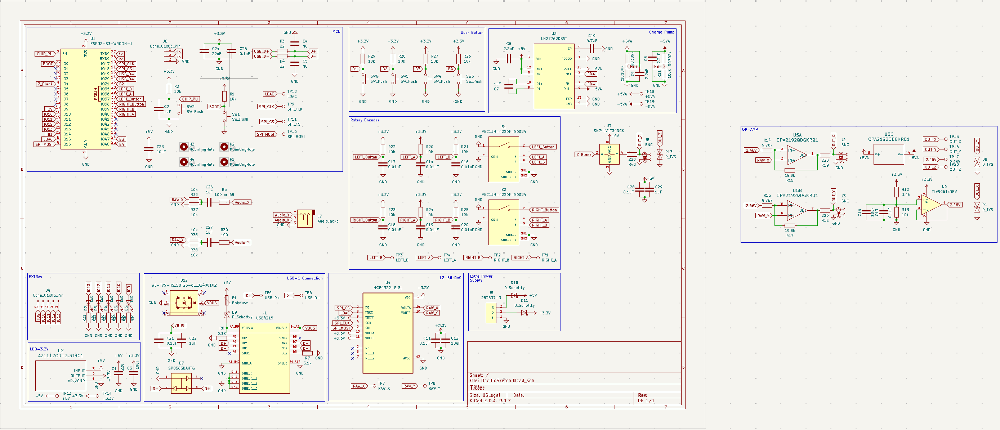

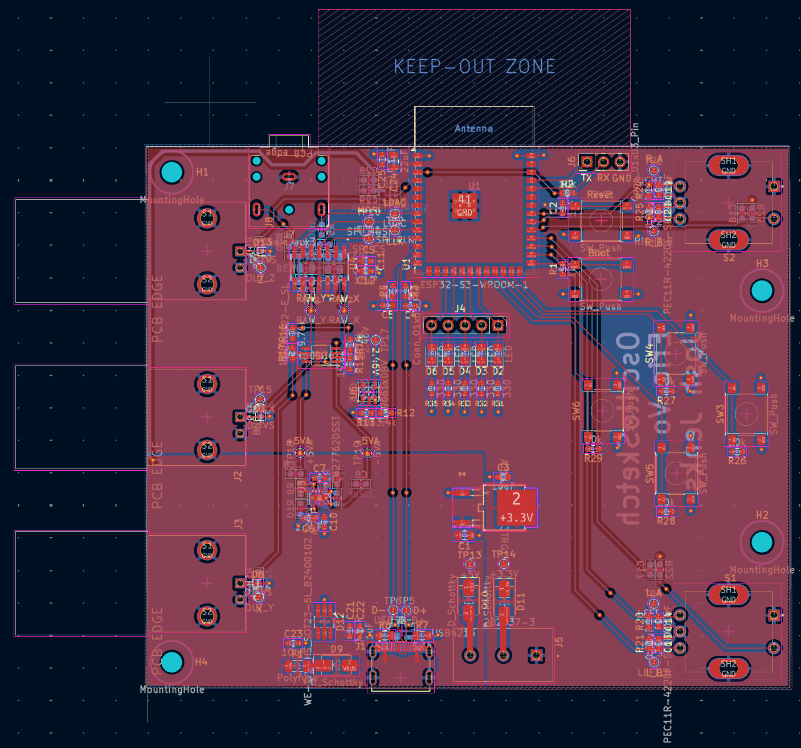

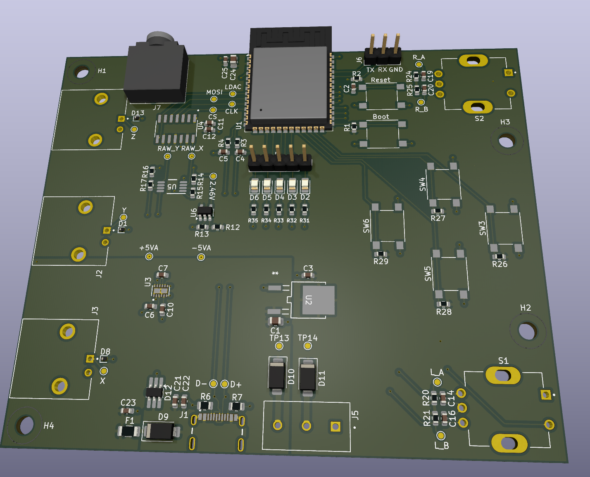

The design document tied together the final hardware architecture:

- USB-C input with CC resistors and protection.
- 3.3 V LDO for MCU/DAC logic.
- LM27762 charge pump for analog rails.
- ESP32-S3-WROOM-1-N16.
- MCP4922 dual 12-bit DAC.
- OPA2192 analog scaling stage.
- BNC output protection.
- Rotary encoders and buttons.

---

## 3. Cost / Schedule Work

We estimated parts cost using DigiKey, eShop, and self-service components. Labor cost was estimated using the course formula:

\[
\text{Labor Cost}=(\$/hour)\cdot 2.5 \cdot (hours)
\]

For an estimated starting salary of $80,000/year:

\[
\frac{80000}{2080}=38.46\$/hour
\]

For 112 hours per partner:

\[
38.46 \cdot 2.5 \cdot 112 \approx 10769
\]

The estimated total project value was dominated by labor cost rather than parts.

---

## 4. Decisions Made

- Completed the design document draft for submission.
- Finished the main schematic/PCB design direction.
- Confirmed final part choices for the first PCB order.
- Included analog tolerance and output protection reasoning in the document.

---

## 5. Next Steps

- Submit/order PCB and parts.
- Prepare for design review.
- Start firmware skeleton while waiting for hardware.

---

# Entry 12
**Date:** 2026-03-04  
**Session Duration:** ~2.5 hours  
**Location:** ECEB / design review preparation  

---

## 1. Objectives

- Prepare for design review and breadboard demo work.
- Decide how to demonstrate useful progress before the final PCB is ready.
- Plan a temporary breadboard version of the signal generation path.

---

## 2. Work Performed

We discussed how to prototype part of the system before the final PCB could be assembled. Many final PCB components are surface-mount and not convenient to breadboard directly, especially the MCP4922/analog output chain. To still demonstrate progress, we looked for available lab parts that could generate analog output from an ESP32.

We found that the lab had HI5731 DAC chips available. These are 12-bit DACs, but they are not SPI. They use a parallel 12-bit data input and current-output style architecture. This means the breadboard demo would not exactly match the final PCB, but it could still prove the main concept: MCU-generated X/Y data can drive DACs and create oscilloscope XY drawings.

---

## 3. Engineering Reasoning

The final PCB architecture is:

ESP32-S3 → SPI DAC → analog scaling → BNC outputs

The breadboard demo architecture became:

ESP32 dev board → 12-bit parallel bus → two HI5731 DACs → oscilloscope XY inputs

This preserves the core idea of two coordinated DAC outputs, even though the interface is different. It is a good intermediate test because the most important early question is whether coordinated X/Y DAC output can generate stable visible scope patterns.

---

## 4. Decisions Made

- Use the available HI5731 DACs for the breadboard demo.
- Use two DACs, one for X and one for Y.
- Share the 12-bit data bus and use separate latch/clock controls for each DAC.
- Keep the final PCB design based on the MCP4922 SPI DAC.

---

## 5. Next Steps

- Study the HI5731 pinout and timing.
- Build a breadboard DAC test setup.
- Write simple ESP32 test firmware for static codes and stair-step output.

---

# Entry 13
**Date:** 2026-03-08  
**Session Duration:** ~4 hours  
**Location:** ECEB lab / breadboard setup  

---

## 1. Objectives

- Build the first breadboard DAC prototype.
- Verify the HI5731 pinout and parallel data bus connections.
- Generate first DAC output from the ESP32.

---

## 2. Work Performed

I wired the ESP32 dev board to the HI5731 DAC breadboard setup. The HI5731 uses a 12-bit parallel input, so I had to assign twelve GPIO pins as data outputs. I also used control lines for latching/updating the DAC output.

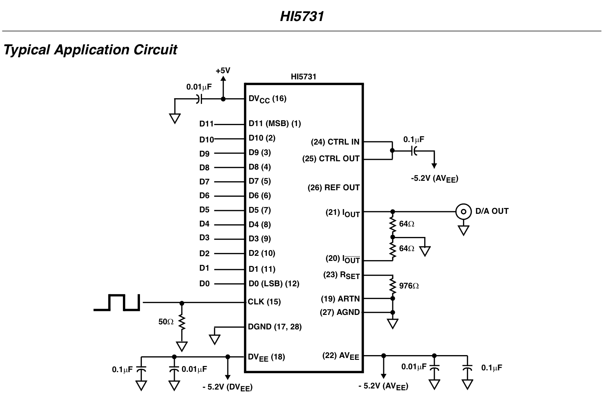

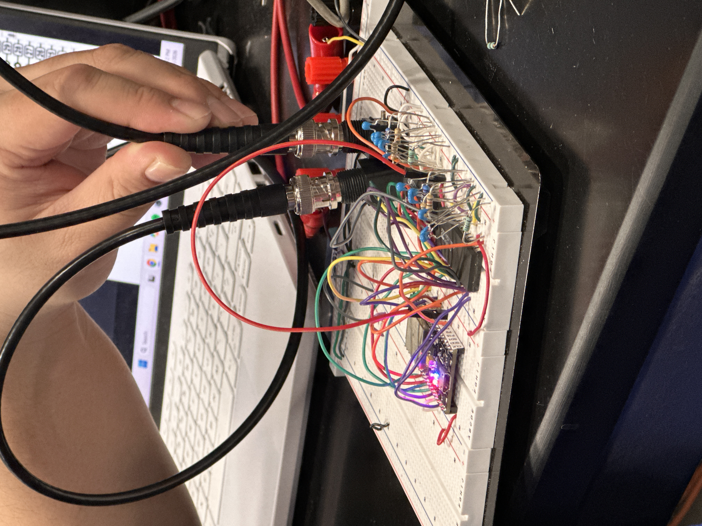

The first tests focused on proving that the ESP32 could set DAC codes and that the DAC output changed predictably. I wrote local breadboard test code for static output values and then a stair-step pattern.


---

## 3. Testing / Observations

The stair-step pattern confirmed that the DAC was responding to changing digital codes. This was important because the breadboard wiring had many parallel data lines, making pin-order mistakes likely.

The main observations were:

- The DAC output changed in discrete steps as expected.
- The ESP32 could update the parallel bus fast enough for early testing.
- The wiring was much more fragile than the final PCB would be because of the number of jumper wires.

---

## 4. Debugging Notes

The breadboard setup required checking GPIO numbering carefully. Since the ESP32 pin labels do not always map intuitively to Arduino GPIO numbers, I had to verify the actual pins used in firmware. This became important later because one GPIO choice interfered with ESP32 boot behavior.

---

## 5. Decisions Made

- Continue using the HI5731 breadboard setup as a demo platform.
- Move from one-DAC tests to two-DAC X/Y output tests.
- Keep the breadboard code separate from the final PCB firmware because the final board will use SPI instead of a parallel DAC bus.

---

## 6. Next Steps

- Add a second DAC for Y output.
- Generate simple X/Y patterns such as diagonal line, square, and heart.
- Connect outputs to oscilloscope XY mode.

---

# Entry 14
**Date:** 2026-03-11  
**Session Duration:** ~4 hours  
**Location:** ECEB lab / oscilloscope testing  

---

## 1. Objectives

- Extend the breadboard demo to two DAC channels.
- Display X/Y patterns on the oscilloscope.
- Learn what update behavior is needed for persistence on an analog scope.

---

## 2. Work Performed

I added the second DAC channel and used the two DACs as X and Y outputs for oscilloscope XY mode. The goal was to generate recognizable shapes by coordinating the two output voltages.

Test patterns included:

- Horizontal line.
- Vertical line.
- Diagonal line.
- Box / square outline.
- Heart shape.


---

## 3. Testing / Observations

The breadboard prototype successfully generated visible XY shapes. This confirmed the core project concept: if the MCU updates two DAC outputs in a coordinated way, the oscilloscope can display vector-like graphics.

The main lesson was that an analog oscilloscope does not store a digital frame. A drawing only remains visible if the firmware continuously replays the points fast enough. This means the firmware architecture cannot just output each point once. It needs a replay buffer or continuous pattern generation loop.

This changed the firmware problem from:

“output a point when the user moves”

to:

“store points and replay the whole path continuously while also accepting new input.”

---

## 4. Design Implication

This test made replay rate a core requirement. For a path of \(N\) points and replay rate \(f_{update}\), the time to redraw the full path is:

\[
T_{frame}=\frac{N}{f_{update}}
\]

If \(T_{frame}\) gets too large, the drawing visibly retraces and loses persistence. This later became one of the biggest firmware optimization problems.

---

## 5. Decisions Made

- Confirmed that continuous replay is required for the final firmware.
- Planned a drawing buffer / replay engine for Etch-a-Sketch mode.
- Kept preset shape generation as a useful way to test replay without user input.

---

## 6. Next Steps

- Start final PCB firmware skeleton.
- Implement DAC driver, drawing engine, input manager, and mode logic for the MCP4922 board.
- Prepare for PCB assembly and bring-up.

---

# Entry 15
**Date:** 2026-03-26  
**Session Duration:** ~3 hours  
**Location:** ECEB lab / PCB bring-up planning  

---

## 1. Objectives

- Prepare for final PCB bring-up.
- Confirm that the assembled PCB can be programmed.
- Begin transitioning from breadboard firmware to final PCB firmware.

---

## 2. Work Performed

The raw PCB was assembled enough to verify programming and basic connectivity. At this stage, not all external connectors were fully installed, but the board could be powered and programmed, which was the first major bring-up checkpoint.

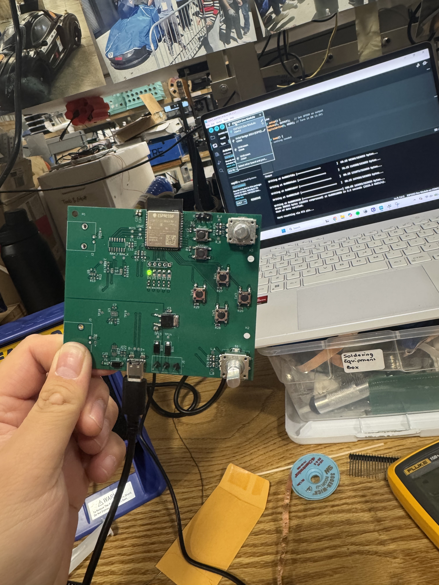

I reviewed the final PCB pin map and translated it into firmware constants. The relevant final pin map used later in firmware was:

- SPI MOSI = GPIO16.
- SPI CLK = GPIO17.
- SPI CS = GPIO18.
- LDAC = GPIO15.
- Left encoder A/B/button = GPIO36/GPIO35/GPIO37.
- Right encoder A/B/button = GPIO40/GPIO39/GPIO38.
- Front buttons B1/B2/B3/B4 = GPIO14/GPIO21/GPIO47/GPIO48.

---

## 3. Code / Firmware Work

I started organizing the final firmware into separate files rather than keeping everything in one `.ino` file. The planned structure was:

- `OscilloSketch.ino`
- `pins.h`
- `config.h`
- `dac_driver.h/.cpp`
- `drawing_engine.h/.cpp`
- `input_manager.h/.cpp`
- `app_modes.h/.cpp`

This split made the code easier to reason about because the DAC driver, input handling, drawing storage, and mode logic each had separate responsibilities.

AI assistance was used during some firmware planning/refactoring, but all code was tested on the actual board and adjusted based on measured behavior.

---

## 4. Decisions Made

- Proceed with the multi-file Arduino firmware structure.
- Use explicit LDAC control for synchronized X/Y DAC updates.
- Keep all PCB pin definitions centralized in `pins.h`.
- Begin with simple static/preset outputs before relying on full Etch mode.

---

## 5. Next Steps

- Test raw DAC output through the MCP4922.
- Output simple shapes on the actual PCB.
- Add encoder/button input handling.

---

# Entry 16
**Date:** 2026-04-01  
**Session Duration:** ~5 hours  
**Location:** ECEB lab / PCB firmware testing  

---

## 1. Objectives

- Bring up the full PCB firmware on hardware.
- Verify MCP4922 SPI output and LDAC behavior.
- Display a recognizable shape using the final PCB.
- Start debugging analog output artifacts.

---

## 2. Work Performed

I tested the assembled PCB using the final SPI DAC path. The board produced a recognizable heart output on the oscilloscope, showing that the ESP32-S3, MCP4922, analog output chain, and BNC connection were all working together.

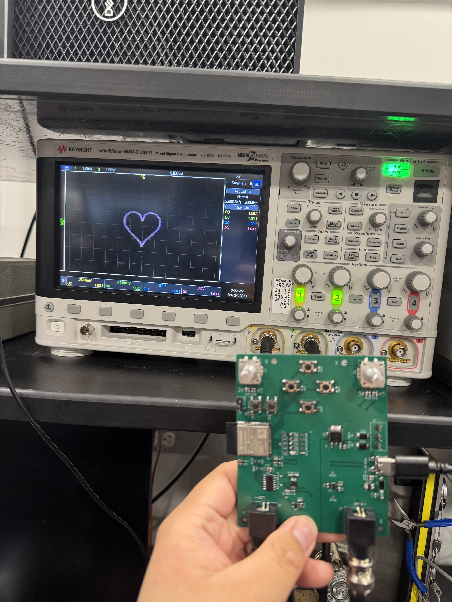

At this point, I also started building the working mode framework:

- Etch-a-Sketch mode.
- Shape demo mode.
- Pong placeholder / early implementation.
- Audio/streaming placeholder.

The firmware stored generated points and replayed them through the DAC so the scope image would remain visible.

---

## 3. Testing / Observations

The first working PCB output proved the hardware path was alive, but the output was not perfect near the edges of the screen. When the DAC codes approached the extremes, the displayed waveform could become distorted or zig-zagged.

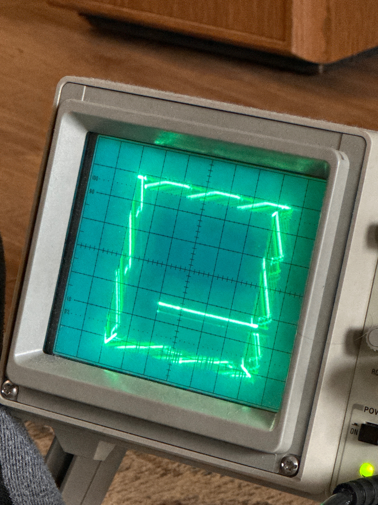

Initial hypothesis:

- The DAC itself was likely producing correct codes.
- The analog stage or supply rails were likely losing headroom near the extremes.
- The issue was worse when commanding outputs near full-scale rails.

---

## 4. Debugging Notes

A major oscilloscope setup issue was also identified around this period: AC coupling on the scope can make XY drawings look shifted or distorted because the DC component is removed. For accurate XY drawing, the scope channels need to be DC-coupled. After switching to DC coupling, straight-line behavior improved.

Since the zig-zag artifact still appeared near edge values, the next firmware fix was to clamp the usable DAC drawing range away from the rails.

---

## 5. Decisions Made

- Keep the final PCB hardware path and continue debugging in firmware/measurement.
- Add safe drawing bounds in firmware instead of allowing full 0–4095 DAC output for normal drawing.
- Continue using center code 2048 as the default resting position.

---

## 6. Next Steps

- Tune `DRAW_MIN_CODE` and `DRAW_MAX_CODE` to avoid rail artifacts.
- Improve Etch mode input behavior.
- Prepare a stable set of modes for progress demo.

---

# Entry 17
**Date:** 2026-04-06  
**Session Duration:** ~4 hours  
**Location:** ECEB lab / progress demo preparation  

---

## 1. Objectives

- Prepare a stable version of the project for the progress demo.
- Make Etch mode usable.
- Add reset and mode switching behavior.
- Avoid visible rail artifacts during demonstration.

---

## 2. Work Performed

I tuned the firmware so that Etch mode could draw on the oscilloscope using the rotary encoders. The reset button behavior was defined so the drawing buffer clears and the cursor returns to center.

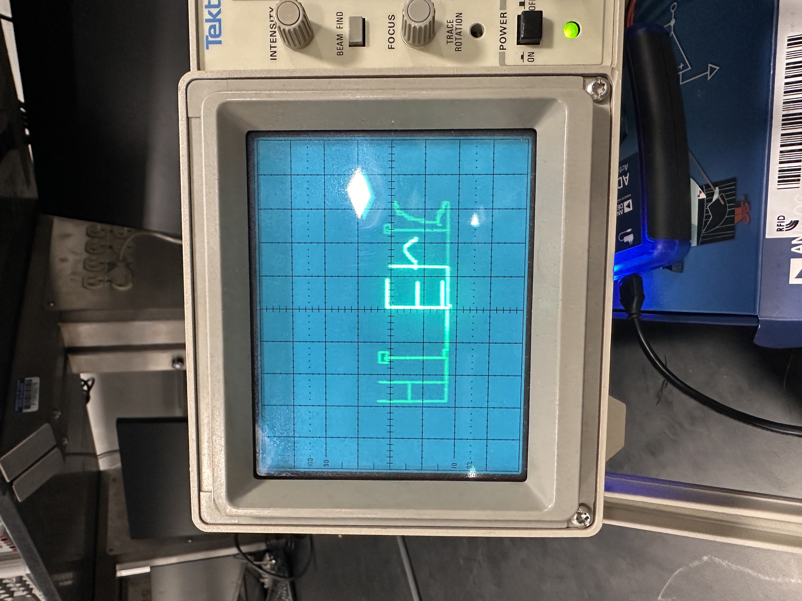

I also confirmed that the mode button could cycle between available modes. At this stage, the important demo modes were:

- Etch-a-Sketch drawing.
- Preset shape demo.
- Placeholder / developing modes for later features.

The DAC output range was clamped to avoid the worst edge zig-zag behavior. Instead of using full 0–4095 codes, the drawing range was limited to a safer window. This reduced the visible artifacts and made the demo more stable.

---

## 3. Testing / Observations

The output looked much better when the firmware avoided commanding values too close to the analog rails. This supported the hypothesis that the edge artifacts were caused by analog rail/op-amp headroom limitations rather than path buffer logic.

The progress demo goal was not to prove every final requirement yet. The goal was to show that the PCB worked, the oscilloscope could display drawings, and the basic user interaction was functional.

---

## 4. Decisions Made

- Use software clamping to keep normal drawing inside the clean analog range.
- Demo Etch and preset shape functionality for progress demo.
- Avoid overclaiming exact full-scale ±5 V output until final R&V testing.

---

## 5. Next Steps

- Improve output refresh rate so longer drawings remain persistent.
- Finish Pong mode.
- Investigate negative rail / USB supply behavior.
- Add optional audio and Z-blanking features if time allows.

---

# Entry 18
**Date:** 2026-04-17  
**Session Duration:** ~5 hours  
**Location:** ECEB lab / firmware integration  

---

## 1. Objectives

- Expand the firmware from base Etch mode into multiple operating modes.
- Improve code organization around shared replay and mode-specific generation.
- Add working Shape and Pong behavior.

---

## 2. Work Performed

I continued refactoring the firmware so that each mode could generate its own X/Y coordinate data while sharing one low-level output path. This avoided duplicating DAC code inside every mode.

The mode structure became:

- **Etch mode:** stores user-generated path points.
- **Shape mode:** generates preset vector patterns.
- **Pong mode:** generates a real-time game frame with paddles, ball, collisions, and score.
- **Audio mode:** initially synthetic/preset audio visualization, later live/embedded audio experiments.

The shared lower layer handled:

- Point storage.
- Replay indexing.
- DAC command generation.
- SPI writes.
- LDAC pulse.

---

## 3. Code / Pseudocode

High-level architecture:

```cpp
loop() {
    readInputs();
    updateActiveMode();
    generateOrAppendPoints();
}

replayTaskOrTimer() {
    ReplayStep p = getNextReplayPoint();
    writeDacX(p.x);
    writeDacY(p.y);
    pulseLDAC();
}
```

This separation was important because the oscilloscope does not care which mode generated the points. It only needs a continuous high-speed X/Y stream.

AI assistance was used to help reason through some firmware refactors and code structure, but each change was checked against the actual project behavior on hardware.

---

## 4. Testing / Observations

Etch, Shape, and Pong all used the same DAC output path successfully. This confirmed that the shared replay abstraction was the right direction.

Pong was a good stress test because it required dynamic frame updates instead of just replaying a static shape. The firmware needed to update paddle position, ball velocity, wall collisions, paddle collisions, and scoring while the replay engine continued refreshing the scope image.

---

## 5. Decisions Made

- Keep mode logic separate from DAC/replay logic.
- Treat replay as the shared output layer for all visual modes.
- Continue improving replay speed because all modes benefit from it.

---

## 6. Next Steps

- Measure the actual replay/update rate.
- Replace slow Arduino calls in timing-critical paths where necessary.
- Investigate using ESP32 hardware timers or dual-core operation for higher refresh.

---

# Entry 19
**Date:** 2026-04-20  
**Session Duration:** ~4 hours  
**Location:** ECEB lab / power and supply debugging  

---

## 1. Objectives

- Investigate analog rail behavior under different USB power sources.
- Determine why the negative rail was not always close to −5 V.
- Decide what power source should be used for demo and verification.

---

## 2. Work Performed

We measured board behavior with different USB-C power sources. The system sometimes showed weak negative rail behavior when powered from a laptop or older charger, but behaved much better from a higher-power USB-C charger. One observation was that the board current reported by the computer was around 93–98 mA, which suggested the USB source / negotiation behavior might be limiting available current or causing the charge pump to operate poorly.

The important practical result was that the analog rails depended on the supply source more than expected. A newer high-power USB-C wall charger gave much better positive and negative analog rails than the laptop port or older charger.

---

## 3. Testing / Observations

Observed behavior:

- Laptop/older USB power sometimes produced a poor negative rail.
- Higher-power USB-C charger produced rails much closer to the expected ±5 V.
- The board itself drew under the 500 mA requirement, but the source behavior still mattered.

This explained why the same firmware/output could look better or worse depending on the charger. The charge pump and op-amp output stage need enough input supply quality to maintain analog headroom.

---

## 4. Design Reasoning

The project requirement is single USB-C operation, not necessarily laptop-port-only operation. A USB-C wall adapter is still a valid single-cable power source. For final demo and verification, the board should be powered from the known-good USB-C charger to avoid rail sag and inconsistent analog output.

---

## 5. Decisions Made

- Use the better USB-C wall charger for demo/verification.
- Document measured current draw and rail voltages under known-good operating conditions.
- Keep software output bounds to avoid rail extremes even when rails are nominal.

---

## 6. Next Steps

- Continue final R&V measurements using the reliable power source.
- Measure final 3.3 V, +5 VA, −5 VA, and BNC output swing.
- Continue firmware refresh optimization.

---

# Entry 20
**Date:** 2026-04-21  
**Session Duration:** ~5 hours  
**Location:** ECEB lab / replay optimization  

---

## 1. Objectives

- Diagnose why longer drawings showed visible retrace.
- Measure the real replay rate on hardware.
- Determine whether the bottleneck was hardware, SPI, DAC, or firmware architecture.

---

## 2. Work Performed

I measured timing signals including LDAC, CS, SCK, and MOSI. The key signal was LDAC because it marks a completed coordinated X/Y update. CS and SPI activity can pulse faster internally, but LDAC indicates when both X and Y outputs are actually updated together.

Early firmware used a software-timer replay approach. That version was effectively limited around a 50 µs LDAC period, or about:

\[
f=\frac{1}{50\mu s}=20kHz
\]

This explained why long Etch drawings showed visible retrace. The stored point buffer could hold many points, but the visual persistence depended on how fast the full path could be replayed.

---

## 3. Analysis

For a path with \(N\) stored points and replay rate \(f\):

\[
T_{replay}=\frac{N}{f}
\]

At 20 kHz, a 2000-point drawing takes:

\[
T=\frac{2000}{20000}=0.1s
\]

That is slow enough for retrace/persistence artifacts to become visible on an analog scope. This led to the important conclusion:

The 20,000-point buffer limit is a memory limit, not a visual limit.

A higher replay rate was needed so larger drawings could remain visually solid.

---

## 4. Decisions Made

- Treat replay rate as a central firmware architecture problem.
- Move away from the original software timer path.
- Test ESP32 hardware timer / GPTimer approaches.
- Use LDAC period as the primary metric for completed X/Y update rate.

---

## 5. Next Steps

- Implement a hardware-timer-based replay version.
- Optimize GPIO/SPI operations in the fast path.
- Compare single-core and dual-core replay architectures.

---

# Entry 21
**Date:** 2026-04-23  
**Session Duration:** ~5 hours  
**Location:** ECEB lab / firmware timing optimization  

---

## 1. Objectives

- Improve replay speed beyond the software-timer limit.
- Test single-core hardware timer replay.
- Investigate dual-core replay using ESP32-S3 RTOS tasks.

---

## 2. Work Performed

I moved the replay architecture from the old software timer toward a hardware-timer/GPTimer-based approach. I also optimized timing-critical GPIO operations by reducing slow Arduino `digitalWrite()` calls in the replay path.

The single-core hardware-timer version improved performance, but it still plateaued around the low-to-mid 30 kHz range for completed LDAC updates. This showed that the old 50 µs software timer limit was gone, but the firmware still had significant per-point overhead.

I then compared this with a dual-core approach. The dual-core architecture used a dedicated replay task pinned to one ESP32-S3 core while the normal application loop handled inputs and mode logic. Early dual-core attempts were faster, but some versions crashed or reset because the replay task could starve the idle task/watchdog if it ran too aggressively.

---

## 3. Debugging Notes

Failed / partial approaches:

- A high-priority replay task could run fast but caused resets.
- Lowering the priority stopped resets but made replay too slow.
- One refactor moved too much app/input work out of `loop()`, causing the board to get stuck replaying only a center dot.

Final direction:

- Keep app/input/mode work in normal Arduino `loop()`.
- Run only the timing-critical replay path in the dedicated task.
- Pace replay carefully so it stays fast without breaking system responsiveness.

---

## 4. Decisions Made

- Use dual-core replay as the final architecture direction.
- Keep input/mode logic separate from the replay task.
- Avoid moving all application logic into a separate RTOS task.
- Continue using LDAC measurement to validate actual output rate.

---

## 5. Next Steps

- Finalize stable dual-core replay implementation.
- Measure maximum stable LDAC rate.
- Select a safe operating update period below the measured limit.

---

# Entry 22
**Date:** 2026-04-25  
**Session Duration:** ~6 hours  
**Location:** ECEB lab / timing validation and Z-blanking work  

---

## 1. Objectives

- Validate final high-speed replay architecture.
- Measure practical maximum update rate.
- Begin integrating Z-blanking support.

---

## 2. Work Performed

The corrected dual-core replay implementation worked successfully on the hardware. GPIO input and mode switching remained responsive, and the board did not reset. I pushed the replay rate upward while measuring LDAC.

The measured LDAC period plateaued around 8.4 µs:

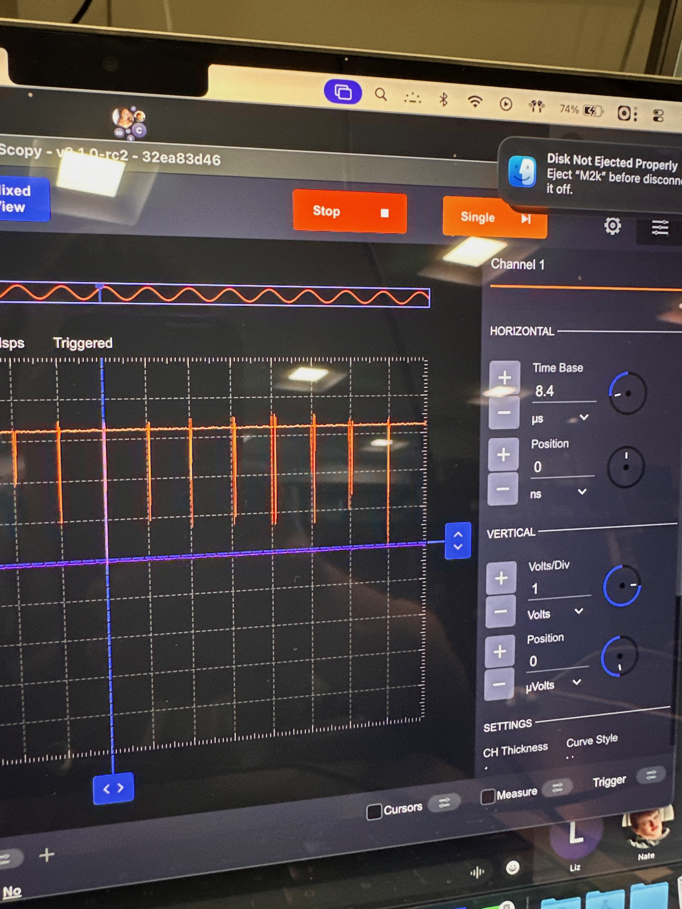

The corresponding frequency is approximately:

\[
f=\frac{1}{8.4\mu s}=119kHz
\]

For stability, I backed the operating point off to about 9 µs:

\[
f=\frac{1}{9\mu s}=111kHz
\]

This exceeded the original 10,000 point/s requirement by roughly 11x.

---

## 3. Z-Blanking Work

I also worked on the Z-blanking path. The hardware uses an MCU GPIO signal through a 3.3 V to 5 V level shifter and then out to a BNC Z connector.

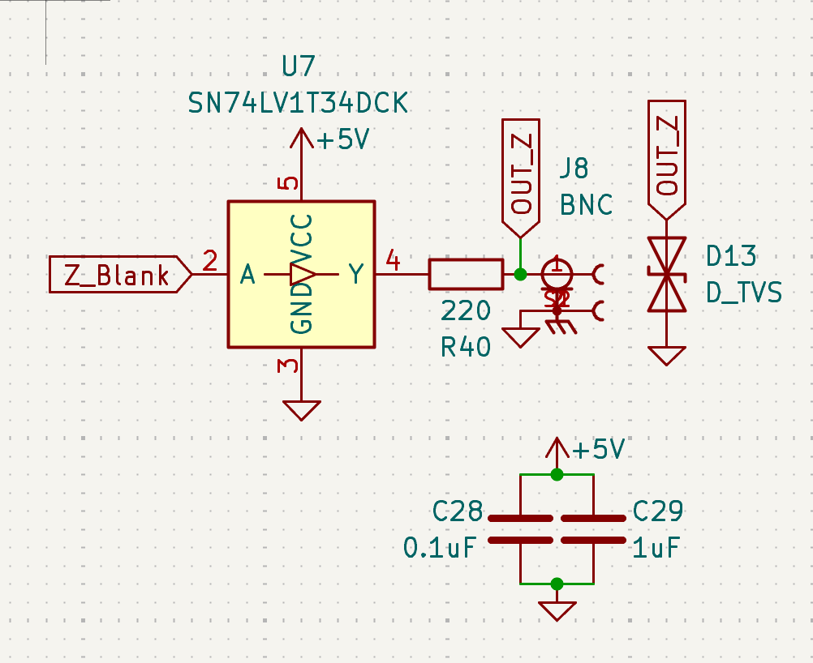

The Tektronix manual information was reviewed to understand the external Z modulation input behavior.

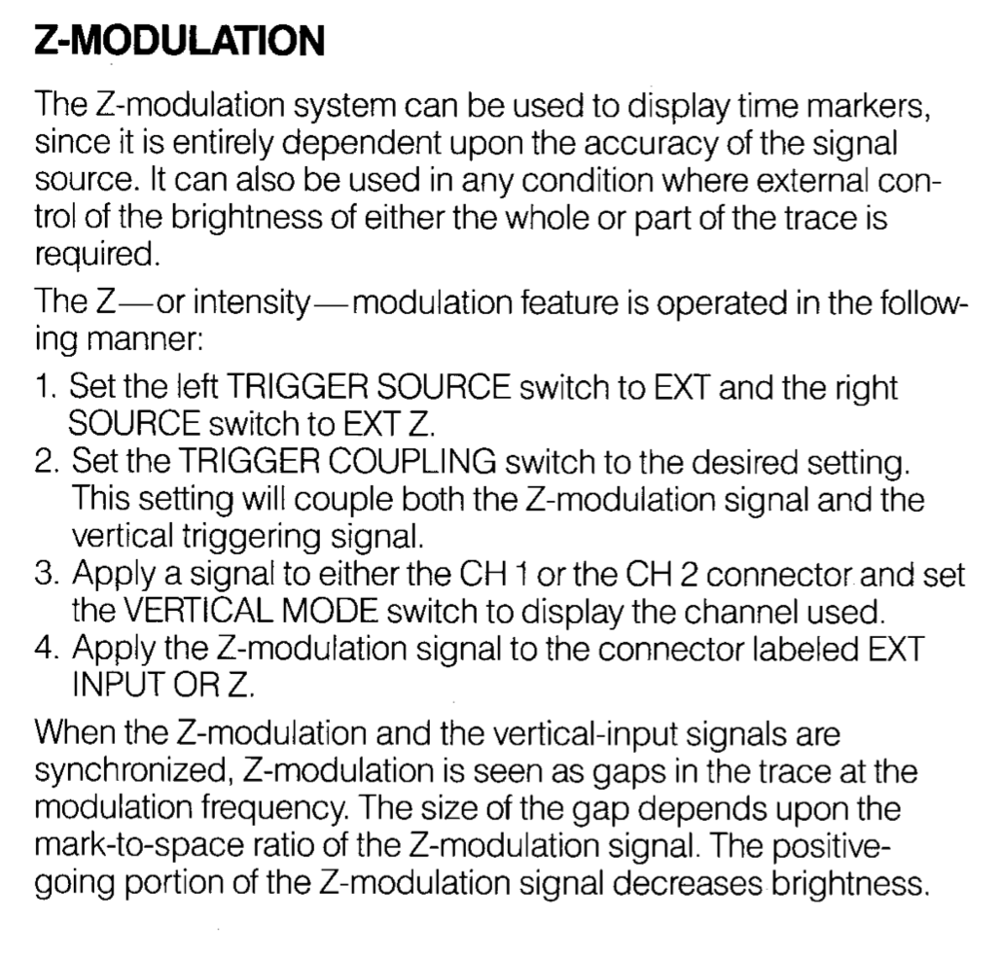

The firmware added replay metadata so individual points could request beam blanking before movement. This required extending the replay point structure so the drawing engine could tell the output layer when a move should be blanked.

---

## 4. Testing / Observations

The high-speed replay result was one of the strongest final firmware measurements. It showed that the ESP32-S3 and MCP4922 hardware path were not the limiting factor once the replay architecture was corrected.

The Z-blanking signal existed in hardware/firmware, but the visual effect was subtle and harder to verify on the oscilloscope than the X/Y output itself. Still, the subsystem was integrated and available for compatible scope behavior.

---

## 5. Decisions Made

- Set final replay rate around 110 kHz for stable operation.
- Keep dual-core replay architecture for the final firmware.
- Keep Z-blanking as an integrated additional subsystem.
- Continue final code work in the testing branch before merging back to main.

---

## 6. Next Steps

- Finalize audio mode.
- Prepare final demo firmware.
- Record final verification results for update rate and reliability.

---

# Entry 23
**Date:** 2026-04-27  
**Session Duration:** ~6 hours  
**Location:** ECEB lab / host computer + firmware audio testing  

---

## 1. Objectives

- Implement live audio streaming from laptop to OscilloSketch.
- Convert an MP3 file into PCM audio packets.
- Map stereo audio samples to X/Y oscilloscope output.
- Use encoder controls for filtering behavior.

---

## 2. Work Performed

I worked on the live-audio path using a Python host script and ESP32 firmware receiver. The Python script `stream_audio_serial.py` loads an audio file, converts it to 16 kHz stereo signed 16-bit PCM, packetizes the samples, and sends them over USB serial.

Code references:

- `stream_audio_serial.py`
- `audio_stream.h/.cpp`
- `audio_mode.h/.cpp`

The basic packet format used magic bytes, packet type, sequence number, frame count, payload, and CRC. The firmware then attempted to store received frames in a ring buffer for playback.

The goal was:

Laptop audio file → Python PCM conversion → serial packets → ESP32 ring buffer → filtered X/Y output → oscilloscope + audio jack

---

## 3. Testing / Observations

Live audio partially worked, but playback was choppy. The oscilloscope showed bursts of audio-derived waveform followed by gaps/flat regions.

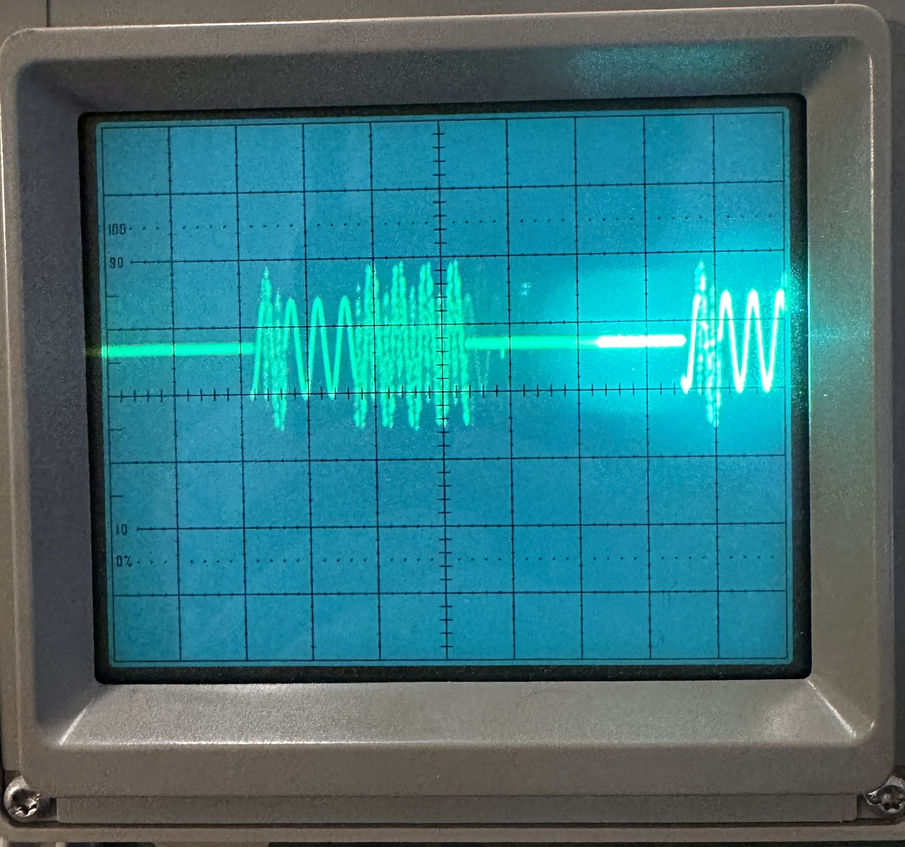

The terminal log showed that the ESP32 was accepting far fewer packets than Python sent, meaning the host was transmitting faster than the ESP32/USB/serial receiver path could reliably process.

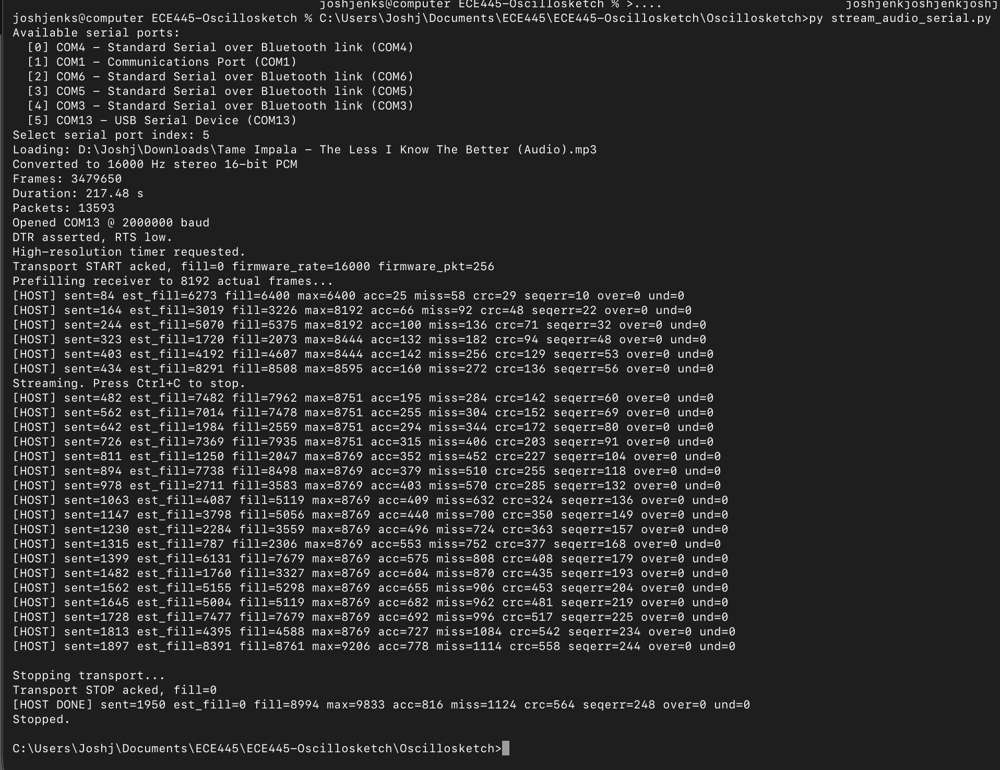

Observed failure modes included:

- Underruns.
- Sequence gaps.
- Packet loss/desynchronization.
- Start/stop playback behavior.
- Good short segments followed by silence or noise.

---

## 4. Debugging Notes

I tried adding protocol structure and reliability features:

- START / DATA / STOP packets.
- Sequence numbers.
- ACK / retry behavior.
- Duplicate detection.
- Prebuffering before playback.
- CRC checks.
- Fill-aware pacing.

The main issue was that reliability mechanisms made timing harder. Stop-and-wait ACK helped correctness but was too slow for continuous real-time audio. Faster streaming improved throughput but caused more dropped/corrupt packets.

---

## 5. Decisions Made

- Continue trying to improve live audio, but do not risk the final demo on unreliable serial streaming.
- Keep direct audio-to-DAC playback because valid audio segments sounded/visualized much better than frame-replay audio.
- Consider embedding a short PCM song in flash as a more reliable final-demo audio source.

---

## 6. Next Steps

- Build an embedded-song converter script.
- Test whether a short song can fit in ESP32 flash.
- Preserve live streaming as future work if it cannot be made stable in time.

---

# Entry 24
**Date:** 2026-04-30  
**Session Duration:** ~5 hours  
**Location:** Remote + ECEB audio firmware work  

---

## 1. Objectives

- Decide final Audio Mode strategy.
- Implement embedded PCM song playback for reliable demo behavior.
- Preserve filter controls while avoiding live serial packet loss.

---

## 2. Work Performed

Since live serial audio remained unreliable, I implemented an embedded-song path. The script `make_embedded_song.py` converts an input song to a C header file named `embedded_song.h`.

Code references:

- `make_embedded_song.py`
- `embedded_song.h`
- `audio_mode.cpp`
- `audio_stream.cpp`

The converter loads an audio file, trims it to a selected duration, converts it to a fixed sample rate, scales the samples, and writes a PROGMEM `int16_t` array.

The generated metadata includes:

- `EMBEDDED_SONG_SAMPLE_RATE`
- `EMBEDDED_SONG_CHANNELS`
- `EMBEDDED_SONG_FRAMES`
- `EMBEDDED_SONG_PCM[]`

I used a Tame Impala song, “The Less I Know The Better,” as the embedded test source. The goal was not to store full high-quality audio, but to have a reliable short PCM segment that could drive the audio visualization mode.

---

## 3. Design Reasoning

The embedded-song approach avoids the weakest part of live audio: USB serial transport continuity. With the PCM already stored on the ESP32, playback timing is local and deterministic. This allows the filters and X/Y mapping to be demonstrated reliably.

Tradeoff:

- **Live streaming:** more impressive and flexible, but unreliable due to packet loss/underruns.
- **Embedded PCM:** less flexible, but reliable and better for final demo.

Because audio mode was an additional subsystem rather than a main requirement, the reliable embedded path was the correct demo decision.

---

## 4. Testing / Observations

The embedded song mode preserved the clearer direct-playback quality that appeared during valid live-stream segments. It also avoided the start/stop behavior from packet underruns. The remaining constraints were flash size and sample duration.

Approximate storage requirement for stereo 16-bit PCM:

\[
\text{bytes/sec}=16000\frac{frames}{s}\cdot2\frac{channels}{frame}\cdot2\frac{bytes}{sample}=64000\frac{bytes}{s}
\]

A 30 s clip requires:

\[
64000\cdot30=1,920,000\text{ bytes}\approx1.83MiB
\]

This is large but possible with the ESP32-S3 N16 flash if the partition scheme supports it.

---

## 5. Decisions Made

- Use embedded PCM audio for the final reliable audio demo.
- Keep live serial audio as future work / partially functional feature.
- Keep encoder-controlled low-pass and high-pass filtering in Audio Mode.
- Keep `make_embedded_song.py` as the reproducible conversion tool.

---

## 6. Next Steps

- Merge final audio work into the main firmware branch.
- Test all four operating modes before final demo.
- Prepare final presentation and report language honestly describing live audio limitations.

---

# Entry 25
**Date:** 2026-05-01  
**Session Duration:** ~4 hours  
**Location:** ECEB lab / final integration and enclosure  

---

## 1. Objectives

- Finalize the physical device for demo.
- Verify that the completed board fits the enclosure.
- Prepare the final integrated version of the project.

---

## 2. Work Performed

The completed board was placed into the enclosure with the buttons, encoders, BNC outputs, USB-C access, and acrylic top cover. This turned the project from a loose lab board into a handheld device that matched the original project idea.

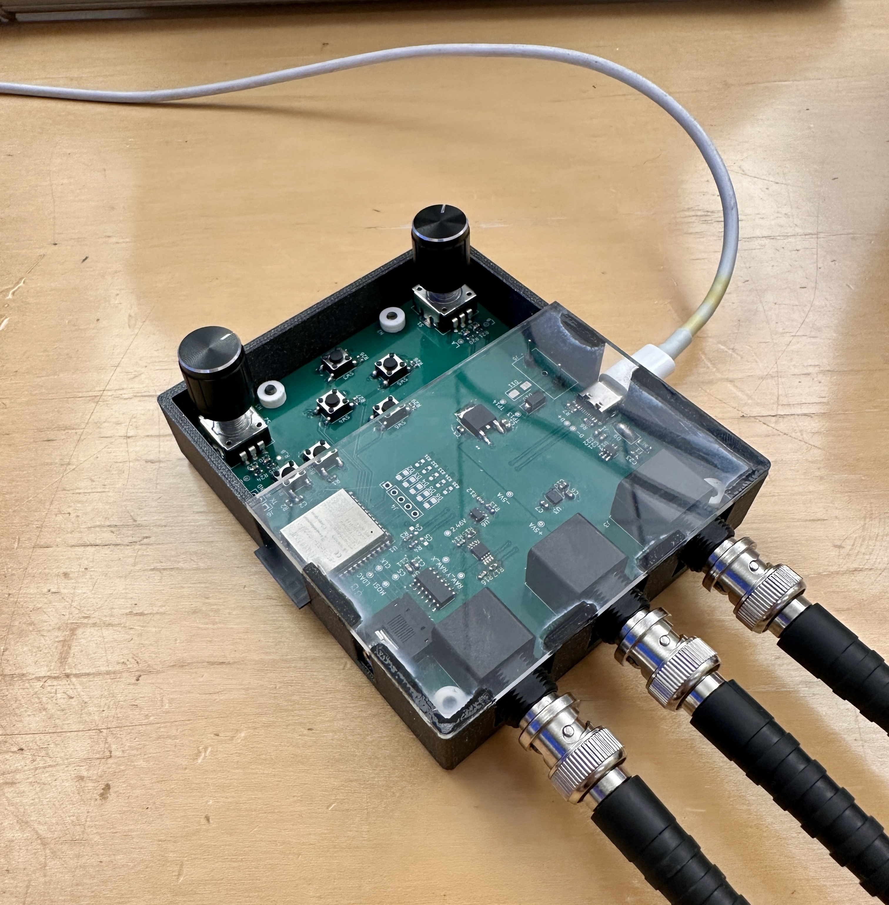

The final device supported:

- Etch-a-Sketch drawing.
- Preset shapes.
- Pong.
- Audio visualization / embedded song mode.
- Z-blanking hardware path.
- USB-C power/programming.
- X/Y BNC outputs.

---

## 3. Testing / Observations

The enclosure made the system much easier to demo because the encoders and buttons were fixed in place. The BNC connectors and USB-C port were accessible from the outside, and the acrylic cover protected the electronics while still making the board visible.

The main ergonomic limitation was that the enclosure was functional rather than polished. It worked for course demo purposes, but future versions could have rounded edges, better grips, and a more controller-like layout.

---

## 4. Decisions Made

- Use the completed enclosure for final demo and presentation photos.
- Treat enclosure ergonomics as future work rather than a blocker.
- Focus final testing on electrical/firmware requirements and mode reliability.

---

## 5. Next Steps

- Finish final R&V measurements.
- Prepare final presentation slides.
- Write final report sections based on measured results.

---

# Entry 26
**Date:** 2026-05-04  
**Session Duration:** ~5 hours  
**Location:** Remote / final report and presentation work  

---

## 1. Objectives

- Prepare final presentation story and technical slides.
- Refine the project framing.
- Summarize final functionality and verification results.
- Begin final report cleanup.

---

## 2. Work Performed

We prepared the final presentation and report material. A major communication decision was to frame OscilloSketch as an educational XY oscilloscope tool, not just a cool drawing toy. The final problem statement became that XY oscilloscope behavior and signal relationships are hard to understand from static examples alone, and OscilloSketch makes those relationships interactive and visible.

The final presentation used the block diagram and subsystem breakdown:

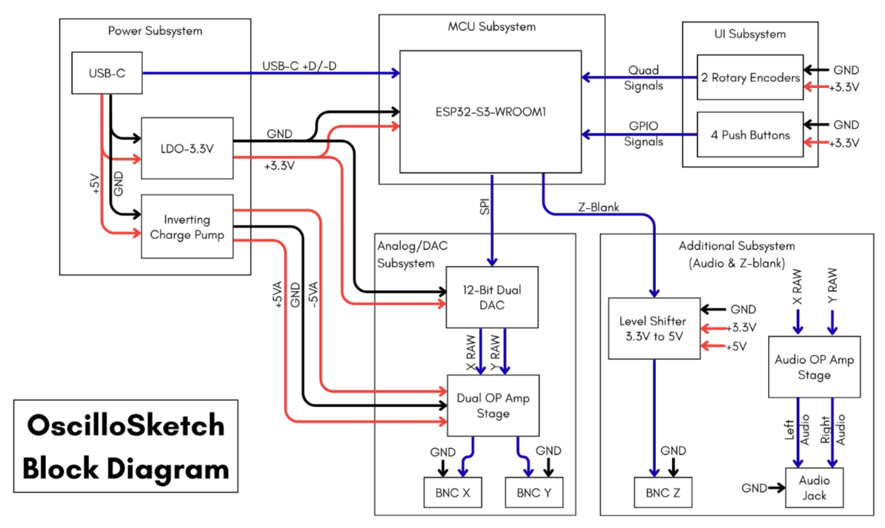

The final slides also summarized the four operating modes:

- Etch-a-Sketch drawing.
- Preset vector shapes.
- Pong.
- Audio visualization with high-pass and low-pass filtering.

---

## 3. Final Verification Results Documented

Final measured results included:

- X/Y output swing around ±4.9 V.
- 3.3 V rail around 3.303 V in final report measurements.
- +5 VA around +4.998 V.
- −5 VA around −4.877 V.
- Current draw around 98 mA, below the 500 mA requirement.
- Input-to-output latency about 19–20 ms.
- Coordinated update rate about 110 kHz.
- SPI clock about 20 MHz.
- Output step size about 2.41 mV/code.

These results showed that the final device met the main requirements for power, analog output, timing, and usability.

---

## 4. Presentation / Report Decisions

The final presentation emphasized:

- The hardware system is a USB-C powered mixed-signal PCB.
- The analog output stage maps 0–3.3 V DAC outputs to approximately ±5 V.
- The firmware needed a high-speed replay architecture because analog oscilloscopes do not store images.
- The final dual-core replay design reached about 110 kHz.
- Live audio streaming was difficult and remained a future improvement, while embedded PCM audio made final Audio Mode reliable.

---

## 5. Decisions Made

- Present OscilloSketch as an interactive educational vector-display platform.
- Clearly state final measured results rather than ideal values.
- Treat live serial audio streaming as a limitation/future work item.
- Keep final report honest about uncertainties and remaining improvements.

---

## 6. Next Steps

- Complete final report revisions.
- Submit final notebook and project materials.
- Attend final demo / award ceremony / lab checkout.

---

# Entry 27
**Date:** 2026-05-05  
**Session Duration:** ~4 hours  
**Location:** Final presentation / report submission  

---

## 1. Objectives

- Finalize and submit the final report.
- Present final project results.
- Ensure notebook and supporting files are ready for checkout.

---

## 2. Work Performed

We completed the final report and presentation materials. The final report documented the full system architecture, design calculations, subsystem requirements, verification results, cost analysis, conclusion, uncertainties, ethics, and future work.

The final report abstract summarized the completed system as a handheld embedded device that generates coordinated X and Y analog voltages for oscilloscope XY mode. The final design supported four operating modes: Etch-a-Sketch drawing, preloaded vector shapes, Pong, and music visualization with filtering.

The final design met the main requirements:

- Approximately ±4.9 V X/Y outputs.
- USB-C operation under 500 mA.
- Real-time user response.
- 110 kHz coordinated update rate.
- Stable interactive drawing and multiple display modes.

---

## 3. Final Reflection

This project ended up combining more areas than expected:

- PCB design.
- USB-C power.
- Charge pump rail generation.
- Op-amp scaling and level shifting.
- DAC timing.
- ESP32-S3 firmware.
- RTOS / dual-core replay.
- Oscilloscope measurement.
- Audio processing / serial transport debugging.
- Mechanical enclosure work.

The hardest technical issue for me was not basic DAC output. It was realizing that the oscilloscope display persistence depends on replay architecture, and then pushing the firmware from roughly 20 kHz to around 110 kHz. The live audio work was also difficult because it mixed host software, serial protocol reliability, embedded buffering, and real-time playback.

---

## 4. Final Status

Final working features:

- Etch-a-Sketch drawing.
- Shape demo.
- Pong.
- Audio visualization / embedded song playback.
- Encoder/button UI.
- USB-C powered board.
- X/Y BNC analog output.
- Z-blanking hardware/firmware path.
- Enclosure integration.

Remaining future work:

- More ergonomic enclosure.
- More games / function generator modes.
- More reliable live audio streaming.
- Better Z-blanking verification and tuning.

---

## 5. Next Steps

- Submit final notebook.
- Complete lab checkout.
- Archive code, report, slides, and supporting images in the project repository.
