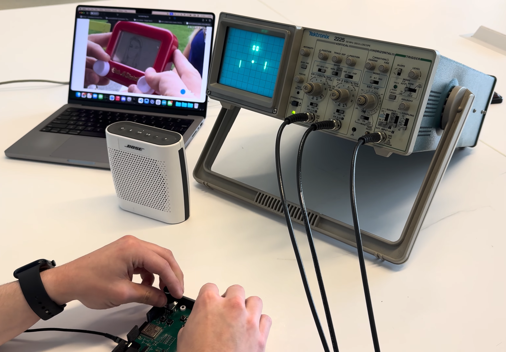

# OscilloSketch

**OscilloSketch** is a handheld embedded system that turns a standard oscilloscope operating in XY mode into an interactive vector display.

Developed for **ECE 445: Senior Design at the University of Illinois Urbana-Champaign**, the project uses an ESP32-S3, dual 12-bit DAC, precision analog output stage, rotary encoders, and custom firmware to generate synchronized X/Y analog signals for drawing, vector graphics, gameplay, and audio visualization.

The final system is powered entirely over USB-C, produces approximately **±5 V X/Y outputs**, and updates coordinated X/Y points at approximately **110 kHz**.

**Team 22 — Spring 2026**  
Josh Jenks · Eric Vo

🏆 **Inducted into the ECE 445 Hall of Fame — an honor awarded to 10 teams out of approximately 100 projects (top 10%).**

## Demo

[](https://youtu.be/4ph56uAzl1s?si=MtNzPyYdsF7Att4c)

**[Watch the final project demo on YouTube →](https://youtu.be/4ph56uAzl1s?si=MtNzPyYdsF7Att4c)**

> Etch-a-Sketch drawing, vector graphics, Pong, audio visualization, and real-time filtering on an analog oscilloscope.

---

## Features

OscilloSketch supports four primary operating modes:

- **Etch-a-Sketch** — Two rotary encoders directly control X and Y cursor position. Drawn points are stored and continuously replayed so the full path remains visible on the oscilloscope.
- **Shape Demo** — Displays predefined vector patterns to demonstrate coordinated X/Y waveform generation.
- **Pong** — Runs a real-time vector implementation of Pong with paddle control, ball physics, collision detection, and score rendering.
- **Audio Visualization** — Plays a precomputed stereo PCM audio snippet while mapping the left and right channels to X/Y output. The encoders provide real-time low-pass and high-pass filter control.

The firmware also supports **Z-axis blanking** to suppress visible retrace lines between disconnected vector primitives on compatible oscilloscopes.

---

## System Architecture

At a high level:

```text
Rotary Encoders / Buttons
           │
           ▼
      ESP32-S3
           │
       20 MHz SPI
           │
           ▼
     MCP4922 DAC
       RAW X / Y
        0–3.3 V
           │
           ▼
 Precision Analog Stage
           │
      ~−5 V to +5 V
        ┌──┴──┐
        ▼     ▼
      BNC X  BNC Y
        │     │
        └──┬──┘
           ▼
      Oscilloscope
         XY Mode
```

The hardware is powered from a single **5 V USB-C input**. An AZ1117C generates the 3.3 V digital rail, while an LM27762 charge pump generates the approximately ±5 V analog rails used by the output stage.

---

## Firmware Architecture

A key challenge was maintaining enough replay bandwidth for drawings to remain visually persistent on an analog oscilloscope.

The final firmware separates application logic from the timing-critical output path:

```text
Input / Mode Logic
        │
        ▼
Coordinate Generation
        │
        ▼
Shared Replay Engine
        │
        ▼
Dedicated Replay Task
        │
        ▼
SPI DAC Writes + LDAC
        │
        ▼
~110 kHz X/Y Output
```

The main application loop handles user input, mode switching, game logic, and drawing updates. A separate FreeRTOS replay task continuously outputs synchronized X/Y coordinates to the DAC.

This architecture evolved from earlier software-timer and hardware-timer implementations that were limited to substantially lower practical refresh rates. The final dual-core design reached a stable operating rate of approximately **110 kHz**, exceeding the original 10 kHz requirement by roughly 11×.

---

## Hardware

Major components include:

| Subsystem | Component |
|---|---|
| MCU | ESP32-S3-WROOM-1-N16 |
| DAC | MCP4922 dual 12-bit SPI DAC |
| Analog output | OPA2192 |
| Reference buffer | TLV9061 |
| Bipolar supply | LM27762 |
| 3.3 V regulator | AZ1117C |
| User input | 2× PEC11R rotary encoders + 4 pushbuttons |
| Power | 5 V USB-C |
| X/Y output | BNC |
| Audio output | 3.5 mm stereo |
| Z-blanking | 5 V level-shifted BNC output |

The PCB is approximately **98.5 mm × 83 mm** and is mounted in a custom 3D-printed enclosure with an acrylic top panel.

---

## Performance

The completed system met its primary design requirements.

| Parameter | Measured Result |
|---|---:|
| X/Y resolution | 12 bit |
| Coordinated update rate | **110 kHz** |
| SPI clock | **20 MHz** |
| USB input current | **~98 mA** |
| Input-to-output latency | **~19.2 ms** |
| Final X/Y output range | **~−4.88 V to +4.99 V** |
| Analog step size | **2.41 mV/code** |
| X/Y update mismatch | **~560 ns** |

---

## Audio Mode

The original goal was to stream audio from a host computer over USB. Several versions of the serial transport were developed using buffering, sequence tracking, retries, CRC checking, and playback telemetry.

Although the direct audio playback path produced clean output, the live transport remained susceptible to packet loss and start/stop behavior. For the final demonstration, the audio was therefore converted offline to **16-bit PCM** and stored directly in ESP32 flash.

The repository includes `make_embedded_song.py` for generating the embedded audio header.

Example:

```bash
python make_embedded_song.py "/path/to/song.mp3" --seconds 30 --rate 16000 --channels 2
```

FFmpeg and `pydub` are required for conversion.

---

## Repository Contents

This repository contains the final project deliverables:

```text
/
├── firmware/          Final ESP32-S3 firmware
├── lab-notebooks/     Engineering development logs
├── final-report/      ECE 445 final technical report
├── assets/            README media
└── README.md
```

The **final report** contains the complete hardware design, calculations, schematics, requirements, verification procedures, and measured results.

The **lab notebooks** document the development process, including PCB bring-up, firmware architecture changes, debugging, timing measurements, audio experiments, and final system integration.

---

## Building

The firmware targets the **ESP32-S3-WROOM-1-N16** using the Arduino ESP32 environment.

Typical setup:

1. Install the ESP32 Arduino board package.
2. Select the appropriate ESP32-S3 target.
3. Configure the module for **16 MB flash**.
4. Select an application partition large enough for the embedded PCM audio.
5. Compile and upload `Oscillosketch.ino` over USB-C.
6. Connect the X and Y BNC outputs to an oscilloscope configured for XY mode.

Because the final firmware embeds audio in flash, a larger application partition such as **Huge APP** may be required.

---

## Project Requirements

The project was designed around four primary requirements:

- Generate two independent analog outputs with at least **12-bit resolution** and approximately **±5 V range**.
- Operate entirely from a **single 5 V USB-C input** while drawing no more than **500 mA**.
- Provide Etch-a-Sketch input response with **≤20 ms latency**.
- Produce at least **10,000 coordinated X/Y points per second**.

All four primary requirements were met by the completed system.

---

## Documentation

For full technical details, see:

- **Final Report** — system architecture, schematics, design calculations, verification, and final results
- **Lab Notebooks** — chronological development and debugging record
- **Firmware Source** — final embedded implementation

---

## Authors

**Josh Jenks**  
**Eric Vo**

ECE 445 — Senior Design  
University of Illinois Urbana-Champaign  
Spring 2026
